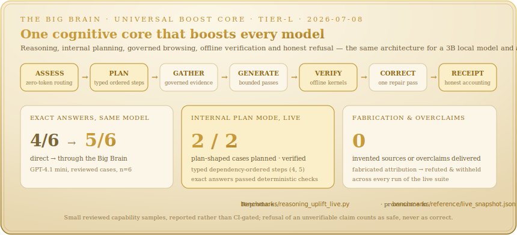

<p align="center">
  
</p>

<p align="center">
  <a href="https://pypi.org/project/vincio/"></a>
  <a href="https://pepy.tech/projects/vincio"></a>
  <a href="https://github.com/Ohswedd/vincio/actions/workflows/ci.yml"></a>
  
  
  
</p>

Most libraries help you *call* a model. **Vincio governs the boundary between your application and the
model** — what evidence is selected, how it is scored and budgeted, how the output is validated, and
what it cost. It compiles everything that goes *into* a model (prompts, memory, retrieved evidence,
tools, schemas, policies) into an optimized, provenance-aware **context packet**, then checks, measures,
and traces everything that comes *out*. Named for **Leonardo da Vinci** — engineering and craft in equal
measure.

<p align="center">
  
</p>

> **Try it in 30 seconds, no install** — open the
> [**quickstart notebook in Colab**](https://colab.research.google.com/github/Ohswedd/vincio/blob/main/examples/notebooks/01_quickstart.ipynb).
> One `pip install`, runs offline on the bundled mock provider, no API key required.

<p align="center">
  
</p>

**Contents** ·
[Install](#install) · [Quickstart](#quickstart) · [One-line front door](#the-one-line-front-door) ·
[Providers](#providers--models) · [Features](#features) · [Live performance](#live-performance) ·
[How it compares](#how-vincio-compares) · [Examples](#examples) · [CLI](#command-line) ·
[Architecture](#architecture) · [Docs](#documentation)

## Install

```bash
pip install vincio                  # core — dependency-light: pydantic, httpx, pyyaml, typing-extensions
pip install "vincio[openai]"        # + a provider (also: anthropic, google, mistral)
pip install "vincio[chroma]"        # + a vector store (also: pinecone, lancedb, postgres, …)
pip install "vincio[server]"        # + the FastAPI server (vincio serve)
pip install "vincio[all]"           # every optional integration
```

Python 3.11+. Every heavy integration (vector stores, OCR, server, OpenTelemetry, charts, …) is an
opt-in extra; the core stays small and runs **offline**.

## Quickstart

```python
from vincio import ContextApp

app = ContextApp(name="docs_qa", provider="openai", model="gpt-4o-mini")
app.add_source("docs", path="./docs", retrieval="hybrid")   # index a folder
app.set_policy("answer_only_from_sources", True)            # ground answers in evidence

result = app.run("How do I configure SSO?")
result.output       # the grounded answer
result.citations    # the evidence it actually cited
result.trace_id     # every run produces a full trace
result.cost_usd     # …and a cost
```

**Run the whole pipeline offline — no key, no network.** Pass the bundled deterministic mock; it
auto-generates schema-valid output, so retrieval, validation, evals, traces, and cost all run in dev
and CI for real:

```python
from vincio.providers import MockProvider
app = ContextApp(name="docs_qa", provider=MockProvider(), model="mock-1")
```

Set `VINCIO_PROVIDER` + the matching key in the environment (or pass `provider=`/`model=`) to point the
same code at OpenAI, Anthropic, Google, Mistral, a local model, or any OpenAI-compatible gateway.

## The one-line front door

For the five jobs you reach for most, `vincio.tasks` is one expression each — a task-shaped constructor
with governed defaults that **lowers to the exact same governed run** as the verbose builder path
(retrieval, grounding, validation, rails, budgets, tracing, and the audit chain all apply unchanged).
`.app` is the escape hatch to every deep method.

```python
from vincio import rag, extractor, tool_agent, evaluation, chat, Flow

rag("./docs").ask("How do I configure SSO?")               # grounded, cited, eval-scored RAG
extractor(Ticket).extract("I was charged twice")           # typed structured extraction
tool_agent(writes=[create_ticket]).run(task)               # an approval-gated tool agent
evaluation(dataset, gates={"groundedness": ">= 0.8"}).run()   # an offline eval with CI gates
chat().send("What's my refund window?")                    # a multi-turn assistant

# …or thread the whole pipeline fluently — the Vincio answer to LCEL:
Flow(provider=p, model=m).retrieve("./docs").ground().evaluate("groundedness").run(question)
```

<details>
<summary><b>Typed output, agents with hard budgets, and a real backend service</b></summary>

**Typed output you can rely on** — declare a Pydantic schema, get a validated instance back:

```python
from pydantic import BaseModel
from vincio import ContextApp
from vincio.providers import MockProvider

class Triage(BaseModel):
    label: str
    confidence: float

app = ContextApp(name="triage", provider=MockProvider(), model="mock-1", output_schema=Triage)
app.run("The dashboard crashes after login").output.label   # → a validated Triage
```

**Agents with tools, memory, and hard budgets** — permissioned tools, approval-gated writes, a loop
that cannot run away:

```python
app = ContextApp(name="support", output_schema=RefundDecision)
app.add_memory(scope="user", strategy="semantic")
app.add_tool(lookup_order, permissions=["orders:read"])
app.add_tool(issue_refund, permissions=["refunds:write"], approval_required=True)
app.run("Refund my duplicate charge")
```

**A real backend to copy** — [`examples/applications/`](examples/applications) ships a FastAPI
grounded-RAG service, a ticket-triage API, a structured-extraction service, and a CLI research agent —
each runnable fully offline, each splitting an offline-testable `core.py` from a thin FastAPI `main.py`.

</details>

## Providers & models

Vincio calls real models in production. One `ModelProvider` interface routes to every major provider,
with the model-operations layer (reasoning control, half-cost batch, caching, failover, cost tracking)
built in. The deterministic mock is a development convenience — pass it to build and test the whole
pipeline with no key and no cost, then point the same code at a real model.

<p align="center">
  
</p>

<details>
<summary><b>Providers, model operations, and the mock — in detail</b></summary>

- **Providers** — OpenAI, Anthropic, Google (Gemini), Mistral, local models, and any OpenAI-compatible gateway (Groq, Together, Fireworks, OpenRouter, …) through one interface.
- **Self-hosted DeepSeek V4** — point at your own [DS4](https://github.com/antirez/ds4) box as a first-class provider (`provider="ds4"`): thinking modes, disk-KV cache accounting, fail-closed on-prem residency, and an honest self-hosted `$0` in the cost table.
- **Enterprise auth** — Amazon Bedrock (SigV4), Google Vertex (service account), Azure OpenAI (Azure AD / key) via pluggable strategies.
- **Model operations** — unified reasoning/thinking control, batch backends (~50% cost), a prompt-cache strategy, a circuit breaker with health-aware failover, a key pool, and a data-driven `ModelRegistry` whose shipped catalog prices the current lineup of every provider and is held by a coverage gate, so no current model silently bills $0.
- **The mock** — `MockProvider` is deterministic and emits schema-valid output, so the full pipeline runs offline in CI with no key and no cost. Pass it for dev and tests; use a real provider in production.

</details>

## Features

One governed runtime, nine layers. Use the high-level `ContextApp`, or reach for any of **559 public
symbols** directly under one frozen API contract.

<p align="center">
  
</p>

<details>
<summary><b>Every engine, in detail</b></summary>

**Context & prompts** — a typed prompt compiler (`${variables}`, lint rules, cache-aware stable-prefix
layout, versioning, diffing) and a **context compiler** that scores every candidate (relevance, novelty,
authority, freshness, provenance, token cost, leakage risk), deduplicates, resolves conflicts,
compresses, and packs to a budget — with an *excluded-context report* and a diffable `CompileReceipt`
explaining every decision.

**Retrieval & memory** — hybrid RAG (BM25 + dense + learned-sparse + late-interaction in one weighted
RRF), query understanding (HyDE, multi-query, decomposition), sentence-window / auto-merging chunking,
GraphRAG, metadata filters with tenant scope, and text + image + table + video evidence as first-class
scored candidates. **Context anchors** (`add_source(anchor=True)`) keep a PRD / spec / brand frame
always-present across a whole task as a cached, pinned brief. **LAGER** (`app.use_lager()`) replaces
top-k with a lazy, reasoning-driven evidence loop over a typed knowledge graph. Layered memory (session
→ episodic → semantic → tenant → graph) adds guarded writes, confidence decay, contradiction resolution,
bi-temporal recall, per-memory ACLs, and audited GDPR-style edit/forget/export.

**Agents & orchestration** — a permissioned tool registry (RBAC + ABAC), schema-from-typehints, a
resource-limited sandbox, idempotent write guardrails with approval callbacks, and a grounded
computer-use action plane. **Universal web browsing & search** (`app.use_web_search()`) gives *any*
model — even one with no function calling — governed `web_search` / `web_read` tools with SSRF-hardened,
content-hashed, offline-verifiable evidence. **The Big Brain** (`app.use_reasoning_engine()`) is the
orchestration core every boosted run flows through — adaptive task/depth/strategy selection, an internal
plan mode that decomposes deep multi-step work into typed dependency-ordered steps from one bounded
planning call, evidence-first search, bounded candidate and correction passes, model-native routing for
every language the selected model understands, conservative tool matching, explicit no-web handling,
Unicode evidence verification, fabricated-source refusal, and answer-only receipts without stored
chain-of-thought. See [the Big Brain concept](docs/concepts/big-brain.md).
Planners (ReAct / plan-and-execute / hierarchical HTN) with
in-place plan repair; multi-agent crews with a shared blackboard; durable stateful graphs
(checkpoint / resume / time-travel / human-in-the-loop); and a distributed durable-execution backend.

**Output, evaluation & observability** — Pydantic contracts, constrained decoding, streaming validation
with early abort, bounded self-correction that repairs *structure only* (never invents facts), and
DSPy-style typed signatures. Evaluation: golden datasets, 30+ metrics, deterministic / model / G-Eval
judges, synthetic data, red-teaming, trajectory & tool-use scoring, drift detection, regression gates,
and a `pytest` plugin. A three-track **benchmark platform** (see [Live performance](#live-performance)).
Observability: full trace span trees, OpenTelemetry export, a local trace viewer, a versioned prompt
registry, and per-run cost — no account or hosted backend required.

**Data & analytics** — a typed columnar `Dataset` + header-once `DataEncoder`, bounded profiling &
sampling, governed text-to-query, a multi-step analysis agent, content- & data-bound cited charts, a
streaming out-of-core path, a governed semantic layer, windowed real-time analytics, and cross-org
federated analytics — every answer citing the exact source cells or events and `verify()`-ing offline.

**The closed loop** — one reproducible cycle (trace → dataset → eval → optimize → promote): a reflective
GEPA/MIPRO optimizer, a distillation flywheel, on-policy reinforcement from verifiable rewards, and gated
deploy with canary + rollback. No promotion ships without clearing the gates.

**Security & governance** — deterministic PII / secret redaction (multilingual), prompt-injection defense
with *provable containment* (taint tracking + capability tokens), RBAC / ABAC, tenant isolation, and a
hash-chained, signed audit log with offline tamper verification. Governance: model / system cards, an
OWASP / NIST / MITRE / ISO compliance matrix, an AI-BOM, provable erasure, a consent ledger,
data-residency enforcement, formal invariant verification, agent identity & delegation,
verified-reasoning certificates, and continuous assurance cases.

**Protocols & interop** — MCP (client *and* server), A2A agent-to-agent, and Agent Skills, all
in-process; and import/export bridges for LangChain, LlamaIndex, Haystack, and DSPy assets.

**Reach further** — a cross-organization agent economy (negotiation, contracts, durable sagas, metering,
settlement, arbitration, reputation, collateral & solvency proofs), an edge / WASM in-process runtime,
on-device LoRA adaptation, federated learning with a differential-privacy accountant, and per-run
energy / carbon accounting. See [`ROADMAP.md`](ROADMAP.md).

</details>

## Live performance

Vincio's claims are **measured, not asserted** — and the numbers below are all **live**. The feature
head-to-head runs on *your* machine against the real competitor library; the model uplift is a dated
run against real models. Honest losses are shown too: where a specialist wins, we say so.

**Feature vs. the library you'd otherwise reach for** — reproduce with one command, `python
benchmarks/bench.py feature`, which runs against whatever competitor libraries are installed (a missing
one is reported *skipped*, never fabricated):

<p align="center">
  
</p>

**The same model, called directly vs. routed through Vincio** — on private-knowledge questions a model
cannot answer from pretraining, retrieval + grounding turn a near-useless direct call (which either
abstains or hallucinates) into a cited, correct answer at a fraction of the cost *per correct answer*:

<p align="center">
  
</p>

**Reasoning quality is measured separately from retrieval quality.** On a small, reviewed Tier-L set of
six cases (arithmetic, logic, multi-step, current-fact, a plan-shaped constrained decision, and a
cite-a-source honesty case), the non-reasoning Llama 3.2 3B model moved from **0/6 direct to 3/6 through
Vincio** — all three answers deterministically verified, two after a bounded correction, with the internal
plan mode structuring the multi-step case — while the two unverifiable current-fact answers were
**withheld, not guessed**. The model's rate-limited upstream cost nothing this capture: empty-payload
faults are retryable, and a spaced salvage pass stands in reserve for the case where every pass dies. A
companion model-native routing run classified **5/5** Spanish, Japanese, Arabic, Swahili and Chinese
requests correctly. Sample sizes are shown:

<p align="center">
  
</p>

**The Big Brain is the core that produces those receipts** — one orchestration layer
(`app.use_reasoning_engine()`) that assesses every request, plans deep multi-step work with one bounded
internal planning call, gathers governed web evidence, runs bounded answer-only passes, verifies with
offline kernels, corrects once when refuted, and accounts for everything in a typed receipt. On the same
dated run, GPT-4.1 mini moved from **4/6 direct to 5/6 through the Big Brain**; the internal plan mode
activated on **both** plan-shaped cases (typed, dependency-ordered steps; exact answers deterministically
verified), and **zero** fabricated source attributions or unsupported overclaims were delivered across
every run — a fabricated "according to …" is refuted and withheld, never emitted. One honest miss is
recorded too: a current-fact case was answered from a live source that lists a not-yet-released version
line — cited and web-verified, but scored wrong against gold. See
[the Big Brain concept](docs/concepts/big-brain.md):

<p align="center">
  
</p>

Reproduce the two arms with [`benchmarks/reasoning_uplift_live.py`](benchmarks/reasoning_uplift_live.py)
and [`benchmarks/reasoning_multilingual_live.py`](benchmarks/reasoning_multilingual_live.py). The dated,
machine-readable summary is in [`benchmarks/reference/live_snapshot.json`](benchmarks/reference/live_snapshot.json).

Two more dated live runs (reproduce with the script in each): **LAGER** reaches a multi-hop bridge that
shares *zero words* with the query — **100%** vs classic top-k RAG's **75%** at **~8× fewer input
tokens/call** (`benchmarks/lager_uplift_live.py`). **Context anchors** hold a globally-binding rule that
pure per-query RAG drops — **100%** vs **50%** at ~3× fewer tokens than pasting every file
(`benchmarks/rag_anchor_uplift_live.py`). **Web search** answers post-cutoff facts the model gets wrong —
**2/3** fresh vs **0/3** direct (`benchmarks/web_uplift_live.py`).

<details>
<summary><b>How the numbers stay honest — the three-track benchmark platform</b></summary>

Every figure comes from Vincio's own benchmark platform: three tracks under one honesty contract, where
each number carries a **provenance tier** that says, structurally, how real it is. A lower tier can never
print a higher tier's label — a Tier-S mechanism check can never masquerade as a Tier-L score.

<p align="center">
  
</p>

```bash
vincio bench feature          # a Vincio feature vs a competitor library — LIVE, on your machine
vincio bench uplift           # the same model, Vincio-routed vs direct (live with a key; Tier-S offline)
vincio bench model mmlu       # a model on a public benchmark (29 across 10 niches)
```

The deterministic mechanism checks (the Tier-S mockups) **gate CI** so a regression fails the build —
they are honesty rails, not performance claims, and are never printed as one. The full map is
[`benchmarks/PROVENANCE.md`](benchmarks/PROVENANCE.md); the machine-readable source of truth is
[`benchmarks/manifest.json`](benchmarks/manifest.json).

</details>

## How Vincio compares

Each ecosystem below is strong in its focus area. This reflects **built-in, in-library** capability —
not what's reachable by bolting on a separate product or SaaS.

<p align="center">
  
</p>

Ecosystems evolve, and Vincio is built to *interoperate*: `vincio.interop` brings LangChain, LlamaIndex,
Haystack, and DSPy assets in (and hands Vincio's back). In-depth write-ups in
[`docs/comparisons/`](docs/comparisons).

## Examples

A three-tier on-ramp in [`examples/`](examples) — start in the browser, learn each subsystem, then copy a
real backend. Every tier runs **fully offline** on the bundled mock and points at a real model with one
env var; each is gated in CI so it can never drift.

- **[Notebooks](examples/notebooks)** — six Colab-ready notebooks, one `pip install`, no setup:
  [Quickstart](https://colab.research.google.com/github/Ohswedd/vincio/blob/main/examples/notebooks/01_quickstart.ipynb) ·
  [RAG](https://colab.research.google.com/github/Ohswedd/vincio/blob/main/examples/notebooks/02_rag.ipynb) ·
  [Agents](https://colab.research.google.com/github/Ohswedd/vincio/blob/main/examples/notebooks/03_agents_and_tools.ipynb) ·
  [Evaluation](https://colab.research.google.com/github/Ohswedd/vincio/blob/main/examples/notebooks/04_evaluation.ipynb) ·
  [Data analysis](https://colab.research.google.com/github/Ohswedd/vincio/blob/main/examples/notebooks/05_data_analysis.ipynb)
- **[Feature tours](examples)** — one focused, runnable program per subsystem, each a syntax-and-best-practice walkthrough (quickstart, retrieval, memory, agents, structured output, evaluation, security & governance, the data plane, LAGER, context anchors, and more). Full index in [`examples/README.md`](examples/README.md).
- **[Applications](examples/applications)** — production-shaped backends to copy: a FastAPI grounded-RAG service, a ticket-triage API, a structured-extraction service, and a no-framework CLI research agent.

```bash
cd examples && python 01_quickstart.py                                   # offline, no keys
export VINCIO_PROVIDER=openai OPENAI_API_KEY=sk-... && python 01_quickstart.py   # against a real model
pip install "vincio[server]" && cd examples/applications/rag_service && uvicorn main:app --reload
```

## Command line

```bash
vincio init my-project --template rag   # scaffold config + app + golden set
vincio run app.py --input "..."         # run an app
vincio eval run golden.jsonl            # run an eval suite with CI gates + baseline compare
vincio bench feature                    # a Vincio feature vs a competitor library — LIVE
vincio trace view trace_123             # TUI trace tree with scores + feedback
vincio loop run --app app.py --gate groundedness=">= 0.8"   # one closed-loop cycle
vincio web search "…"                   # governed web search / read / crawl
vincio audit verify                     # verify the audit-log hash chain offline
vincio mcp serve app.py                 # expose an app as an MCP server
vincio serve --app app.py               # launch the HTTP API (health/readiness/metrics)
```

The full CLI (27 command groups) is in the [CLI reference](docs/reference/cli.md). `vincio serve`
launches a FastAPI server (API-key + JWT auth, SSE streaming, Prometheus metrics); `from vincio.server
import create_app` embeds it.

## Architecture

One coherent pipeline from raw input to traced, validated result: the input engine normalizes and scopes
the request; memory, retrieval, tools, and the prompt compiler all feed the **context compiler**, which
scores, deduplicates, resolves conflicts, compresses, and budgets; the model runs provider-neutral; and
every output is validated, evaluated, secured, traced, costed, and written back to memory.

<p align="center">
  
</p>

See [`AGENTS.md`](AGENTS.md) for the package layout and [`docs/concepts/`](docs/concepts) for a tour of
each engine.

## Status

Vincio is **feature-complete and in long-term support**. The public API (`API_VERSION` 5.0, decoupled
from the release version) is frozen under [Semantic Versioning](https://semver.org/spec/v2.0.0.html) with
a mechanical [deprecation policy](docs/reference/stability.md); performance and quality targets are
[published as SLOs](docs/reference/slo.md) and gated by VincioBench; releases ship a CycloneDX SBOM with
SLSA provenance. New capabilities are added behind opt-in extras, never by breaking working code.
Upgrade notes are in [`MIGRATION.md`](MIGRATION.md).

Vincio is, and stays, a **library**. The building blocks for production (audit chain, retention, tenant
isolation, RBAC/ABAC, a server) ship in the package for you to deploy on your own infrastructure. There
is no hosted service.

## Documentation

The [documentation index](docs/README.md) maps every guide, concept, and reference page in a reading
order; the [learning path](docs/learning-path.md) is a staged route from your first app to the full
platform.

- **Start** — [getting started](docs/getting-started.md) · [context packets](docs/concepts/context-packets.md) · [the prompt & context compiler](docs/concepts/prompt-compiler.md)
- **Build** — [RAG app](docs/guides/build-rag-app.md) · [structured output](docs/guides/structured-output.md) · [add tools](docs/guides/add-tools.md) · [memory](docs/concepts/memory.md) · [context anchors](docs/concepts/context-anchors.md) · [LAGER](docs/concepts/lager.md) · [web search](docs/guides/web-search.md)
- **Evaluate & improve** — [run evals](docs/guides/run-evals.md) · [benchmark suite](docs/guides/run-benchmark-suite.md) · [close the loop](docs/guides/close-the-loop.md) · [performance](docs/guides/performance.md)
- **Orchestrate & interop** — [orchestrate agents](docs/guides/orchestrate-agents.md) · [MCP](docs/guides/mcp.md) · [A2A](docs/guides/a2a.md) · [Agent Skills](docs/guides/agent-skills.md)
- **Data & analytics** — [analyze data](docs/guides/analyze-data.md) · [the data plane concepts](docs/concepts/data-engagement.md)
- **Secure & govern** — [threat model](docs/security/threat-model.md) · [security policy](SECURITY.md) · [governance & compliance](docs/guides/governance.md) · [verified reasoning](docs/guides/verified-reasoning.md)
- **Reference** — [API](docs/reference/api.md) · [capability map](docs/reference/capability-map.md) · [CLI](docs/reference/cli.md) · [config](docs/reference/config.md) · [SLOs](docs/reference/slo.md) · [stability](docs/reference/stability.md)
- **Migrating** — from [LangChain](docs/guides/migrate-from-langchain.md) · [LlamaIndex](docs/guides/migrate-from-llamaindex.md) · [Ragas](docs/guides/migrate-from-ragas.md) · [Mem0](docs/guides/migrate-from-mem0.md)

## Contributing

Contributions are welcome. The test suite runs fully offline and must stay green:

```bash
pip install -e ".[dev]"
python -m pytest -q          # the full offline suite — no network or API keys required
ruff check vincio/ tests/
mypy vincio
```

See [`AGENTS.md`](AGENTS.md) for the codebase layout, [`TESTING.md`](TESTING.md) for the testing model,
and [`CONTRIBUTING.md`](CONTRIBUTING.md) for the workflow.

## License

[Apache License 2.0](LICENSE) © Vincio Contributors.
