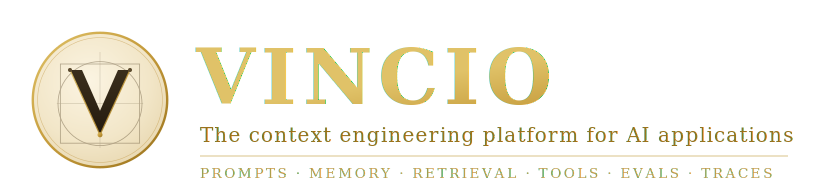

<p align="center">
  
</p>

<p align="center">
  <em>The scarce resource is not the model. It is the context you feed it.</em>
</p>

<p align="center">
  <a href="https://pypi.org/project/vincio/"></a>
  <a href="https://github.com/Ohswedd/vincio/actions/workflows/ci.yml"></a>
  
  
  
  
  
  
</p>

---

**Vincio** is a Python platform for building **context-engineered** AI applications. It compiles
prompts, memory, retrieval, tools, schemas, and policies into optimized, testable, observable,
provider-neutral **context packets** — then validates and evaluates every output.

Most LLM frameworks help you call a model. Vincio governs the *boundary* between your application
state and the model: what evidence is selected, how it is scored and budgeted, how it is rendered
for cache reuse, and how the result is validated, measured, and traced. Named for **Leonardo da
Vinci** — engineering and craft in equal measure.

```text
Raw Input → Normalization → Objective Detection → Memory Selection
→ Retrieval Planning → Evidence Retrieval → Ranking + Distillation
→ Tool Planning → Context Compilation → Model Execution
→ Parsing + Validation → Evaluation + Guardrails → Trace + Learning Loop
```

## Contents

[Why Vincio](#why-vincio) · [Install](#install) · [60-second quickstart](#60-second-quickstart) ·
[Features](#features) · [Benchmarks](#benchmarks) · [Comparison](#how-vincio-compares) ·
[Use cases](#use-cases) · [Examples](#more-examples) · [CLI](#command-line) ·
[Architecture](#architecture) · [Roadmap](#roadmap) · [Documentation](#documentation)

## Why Vincio

Teams ship a prompt, watch it work, then spend months fighting everything around it: context that
overflows the window, retrieved chunks that contradict each other, outputs that fail to parse,
silent quality regressions, untraceable costs, and prompt-injection risk. These are not model
problems — they are **context** problems.

Vincio treats context as a compiled artifact with a clear contract:

- **Deterministic where it matters.** Security, permissions, and validation are enforced in code —
  never gated on model output. The same input compiles to the same packet.
- **Measured, not asserted.** Every run is traced and costed; every change can be gated by an eval
  suite before it ships.
- **Provider-neutral.** OpenAI, Anthropic, Google, Mistral, any OpenAI-compatible endpoint, or a
  deterministic offline mock — behind one interface.
- **One coherent model** from input to output, instead of a bag of loosely-coupled utilities.

## Install

```bash
pip install vincio                  # core — runs fully offline with the mock provider
pip install "vincio[openai]"        # + OpenAI provider
pip install "vincio[anthropic]"     # + Anthropic provider
pip install "vincio[chroma]"        # + a vector store (also: pinecone, lancedb, postgres)
pip install "vincio[langchain]"     # + LangChain interop export (also: llamaindex)
pip install "vincio[all]"           # every optional integration
```

Python 3.11+. Core dependencies are just `pydantic`, `httpx`, `pyyaml`, and `typing-extensions`;
every heavy integration (vector stores, OCR, server, OpenTelemetry, …) is an opt-in extra.

## 60-second quickstart

```python
from vincio import ContextApp

app = ContextApp(name="docs_qa")
app.add_source("docs", path="./docs", retrieval="hybrid")
app.set_policy("answer_only_from_sources", True)

result = app.run("How do I configure SSO?")
print(result.output)      # the grounded answer
print(result.citations)   # evidence the answer actually cited
print(result.trace_id)    # every run produces a full trace
print(result.cost_usd)    # …and a cost
```

No API key? It runs offline out of the box on a deterministic mock provider that emits
schema-valid output — so your whole pipeline (retrieval, validation, evals, traces) runs for real
in CI.

### Typed output

```python
from pydantic import BaseModel
from vincio import ContextApp

class TicketClassification(BaseModel):
    label: str
    confidence: float
    reason: str

app = ContextApp(name="triage", output_schema=TicketClassification)
result = app.run("The dashboard crashes after login")

result.output.label        # → a validated TicketClassification instance
```

### Agents with tools and memory

```python
app = ContextApp(name="support_refunds", output_schema=RefundDecision)
app.add_memory(scope="user", strategy="semantic")
app.add_tool("billing_lookup", permissions=["billing:read"])
app.add_tool("refund_create", permissions=["billing:write"], approval_required=True)

agent = app.agent(max_steps=6)
result = agent.run("Customer asks for a refund on invoice INV-123.")
```

### Multi-agent crews and durable graphs

```python
from vincio.agents import interrupt

crew = app.crew(members=[
    {"name": "researcher", "goal": "gather the numbers", "keywords": ["find"]},
    {"name": "writer", "goal": "draft the recommendation"},
])
result = crew.run("Explain the Q3 refund trend")   # bounded, traced, blackboard-shared

graph = app.graph("review")                        # checkpointed in your own store
graph.add_node("analyze", analyze)
graph.add_node("approve", lambda s: {"ok": interrupt(s, "proceed?")})
graph.add_edge("analyze", "approve")
flow = graph.compile()
paused = flow.invoke({"doc": "msa.pdf"})           # pauses at the human gate
done = flow.resume(paused.thread_id, value=True)   # later — even after a restart
```

### Reliability as a guarantee

```python
from vincio import Signature, InputField, OutputField

class Triage(Signature):
    """Classify a support ticket."""
    ticket: str = InputField(desc="the raw ticket text")
    label: str = OutputField(desc="bug | billing | feature | other")
    confidence: float = OutputField()

result = app.predictor(Triage)(ticket="The export button 500s")  # typed + validated

app.add_rail(name="no_leaks", kind="safety", detectors=["pii", "secrets"], action="redact")
app.add_rail(name="on_topic", kind="topic", direction="input", blocked_topics=["legal advice"])
app.enable_self_correction(max_cycles=2, max_cost_usd=0.05)      # facts never invented
app.add_output_schema(BugReport, keywords=["bug", "crash"])       # multi-schema routing

async for event in app.astream("Extract the invoice"):
    if event.type == "partial_output" and event.valid_prefix is False:
        break   # streaming validation: stop paying for a doomed answer
```

### Evaluation as a gate

```python
from vincio.evals import Dataset, EvalRunner

dataset = Dataset.load("golden/support_triage.jsonl")
report = EvalRunner(app).run(dataset)
report.print_summary()     # groundedness, citation accuracy, schema validity, cost — with CI exit codes
```

### Interoperate: MCP, A2A, Skills

```python
# Consume an MCP server — its tools run through the permissioned, sandboxed,
# audited runtime; its resources become cited evidence.
app.add_mcp_server("weather", command=["python", "weather_server.py"])

# Load portable SKILL.md procedural knowledge (progressive disclosure).
app.add_skill("skills/pdf-invoice")

# Expose your app over the protocols — one ContextApp, both consumer and provider.
mcp_server = app.serve_mcp()                       # serve tools/resources/prompts
a2a_server = app.serve_a2a(crew, name="research")  # Agent Card + task lifecycle

# One portable reasoning knob across providers (thinking tokens are billed).
from vincio.core.types import RunConfig
app.run("Plan the migration", config=RunConfig(reasoning_effort="high"))
```

## Features

Vincio is organized into composable subsystems. Use the high-level `ContextApp` runtime, or reach
for any engine directly.

| Subsystem | What it does |
|---|---|
| **Prompt compiler** | Typed prompt ASTs with `${variables}`, lint rules, cache-aware stable-prefix layout, versioning, hashing, diffing, variant generation. |
| **Context compiler** | Scores every candidate (relevance, novelty, authority, freshness, provenance, token cost, leakage risk), deduplicates, resolves conflicts, compresses, and packs to a token budget — with an *excluded-context report* explaining every omission. |
| **Retrieval (RAG)** | BM25 + dense + learned-sparse (SPLADE-style) + late-interaction (ColBERT-style MaxSim with PLAID-style compression) fused in one weighted RRF; query understanding (HyDE, multi-query, decomposition, step-back); sentence-window, parent-document/auto-merging, and contextual chunking; GraphRAG with community summaries and global/local routing; live indexes (upsert/TTL/migrations); entity-graph, multi-hop, and reasoning retrieval; citations. |
| **Memory** | Layered (session → episodic → semantic → tenant → graph) with a guarded write pipeline, confidence decay, contradiction resolution, and privacy scoping; `remember`/`recall` personalization over user/agent/session scopes, hybrid vector+graph recall, episodic→semantic consolidation with provenance, TTL + importance-weighted retention, audited GDPR-style edit/forget/export/erase, and a CI-gated memory eval harness. |
| **Tools** | Permissioned registry (RBAC scopes + ABAC rules), schema derivation from type hints, a resource-limited sandbox (timeout, output caps, scrubbed env, POSIX CPU/memory/fd `setrlimit`), reliability scoring, idempotent write-action guardrails with approval callbacks. |
| **Agents** | Bounded DAG execution with planners (direct / static / dynamic / ReAct / plan-and-execute), critics, validators, human gates, and hard budget enforcement. |
| **Orchestration** | Multi-agent crews — roles, delegation, and a shared versioned blackboard — with per-agent budget shares and guaranteed termination; durable stateful graphs with checkpoints on your storage, resume, edit-and-resume, and time-travel forks; first-class human-in-the-loop interrupts; a declarative `compose`/pipe API with streaming node events; runtime backends exporting to LangGraph and the OpenAI Agents SDK. |
| **Workflows** | Deterministic DAGs with retries, branching, parallelism, compensation, and approval gates that pause the run and resume without re-executing finished steps. |
| **Structured output** | Pydantic output contracts, provider-native constrained decoding with strict schema sanitization (robust-parser fallback everywhere else), streaming validation with mid-stream early abort, DSPy-style typed signatures (`Signature` / `Predict`) that feed the optimizer, bounded self-correcting loops with cost ceilings, multi-schema routing by task or content, and **principled repair that fixes structure only — never invents facts**. |
| **Evaluation** | Golden JSONL datasets, 30+ task / grounding / quality / safety / conversational / **trajectory & tool-use** / retrieval / operational metrics (faithfulness, answer relevance, hallucination with strict number checks, toxicity, bias, summarization, knowledge retention, tool-call accuracy/F1, goal accuracy, plan adherence, step efficiency), deterministic / model / G-Eval judges with calibration, synthetic dataset generation with provenance, red-teaming judged by the security detectors, experiment tracking with statistical significance, regression gates, and baseline-diff reports — plus a `pytest` plugin (`assert_eval` / `assert_grounded`, packet/trace snapshots). |
| **Agentic eval & continuous quality** | Score *how* a run reached its answer, not just the text: trajectory & tool-use metrics over a `Trajectory` projected from any crew / graph / trace (no re-instrumentation); a deterministic multi-turn `Simulator`; **online evaluation** on a sampled slice of live traffic (score time series, off the hot path); **drift detection** (score + embedding-distribution) raising a `drift.detected` event; human annotation with **Cohen's-κ** judge calibration; production A/B with cost + significance per variant. Every metric doubles as a runtime guardrail (`add_metric_rail`) and optimizer fitness term. |
| **Optimization** | Prompt / context / routing / cache search driven by an eval-fitness function, with safety-gated promotion that blocks any candidate regressing schema validity or safety. |
| **The closed loop** | One continuous, reproducible cycle — trace → dataset → eval → optimize → promote (`ImprovementLoop` / `vincio loop run`): production traces become datasets, the gated optimizer searches, and the winner lands in the prompt registry tagged, eval-linked, applied live, and audited. Plus: grounded auto-memory from runs, eval-driven retrieval feedback (gated fusion/reranker tuning, chunking recommendations), cost/quality Pareto frontiers with knee-point selection, learned per-task budget allocation, and hill-climb/annealing search strategies — every signal flowing through one packet, ledger, and trace. |
| **Observability** | Every run yields a full trace span tree with sessions, threaded runs, user feedback, and eval scores on spans; JSONL and OpenTelemetry exporters (GenAI semantic conventions); a local viewer (TUI + self-contained static HTML export + visual trace diff); traces become eval datasets in one command; a versioned prompt registry with tags, diffs, rollback, and eval links; per-run cost tracking. |
| **Security** | Deterministic PII / secret detection and redaction, prompt-injection defense, programmable input/output rails (topic / format / safety / custom) in the deterministic policy engine, RBAC / ABAC, tenant isolation, and a hash-chained audit log with offline tamper verification (`vincio audit verify`) — all documented in a [threat model](docs/security/threat-model.md) and shipped with SBOM + SLSA provenance attestations. |
| **Storage** | Pluggable metadata (in-memory / SQLite / Postgres), blob, analytics (DuckDB), vector (Qdrant / pgvector / Chroma / Pinecone / LanceDB behind one `build_vector_index` factory), and graph (Neo4j) backends. |
| **Providers** | OpenAI (Chat Completions + Responses API), Anthropic, Google, Mistral, any OpenAI-compatible endpoint (with hosted-gateway presets: groq, together, fireworks, openrouter, deepseek, perplexity, xai, nvidia), and a deterministic offline mock — all async-first with sync wrappers, pooled transport, retries, failover, and in-flight request coalescing. Unified reasoning control (`reasoning_effort` / thinking budget) maps across OpenAI/Anthropic/Gemini, with thinking tokens recorded and billed. |
| **Protocols & interoperability** | Speaks the standards in-process: **MCP** client *and* server (stdio / Streamable HTTP / in-process) — MCP tools run through the permissioned, sandboxed, audited, budgeted runtime; resources become cited evidence. **A2A** agent-to-agent — expose a crew/graph as an Agent Card + task lifecycle, and reach remote agents as bounded, traced crew delegates. **Agent Skills** — `SKILL.md` with progressive disclosure, bundled scripts as sandboxed tools. All via `app.add_mcp_server` / `serve_mcp` / `serve_a2a` / `add_skill` (experimental, since 1.1). |
| **Performance** | End-to-end streaming (`astream` + SSE) with incremental partial-JSON output, concurrent retrieval/memory/tool fan-out with cancellation propagation and hard latency deadlines, content-addressed compile/chunk/embedding caches, zero-copy (slim) context packets, and CI-gated VincioBench performance budgets. |
| **Connectors** | Pluggable data connectors — web, GitHub, SQL, S3, GCS, Notion, Confluence, Slack, plus custom via `register_connector` — feeding the document engine with full provenance: `app.add_source("kb", connector=connect("github", repo="acme/handbook"))`. |
| **Integrations & DX** | LangChain + LlamaIndex interop (`vincio.interop`) for tools, retrievers, loaders, and embeddings — both directions, duck-typed `from_*` (no heavy import); hosted rerankers/embedders (Cohere/Jina/Voyage, httpx-only) behind `build_reranker`/`build_embedder`; opt-in domain packs (support, engineering, finance, legal) via `app.use_pack(...)`; `vincio init` templates (rag/agent/eval) with a typed `vincio.yaml` JSON Schema for editor completion; notebook reprs (`enable_rich_reprs`) and an interactive `vincio tui` inspector. |
| **Stability & guarantees** | [Semantic Versioning](https://semver.org/spec/v2.0.0.html) on a frozen public surface (`vincio.__all__`) with a mechanical [deprecation policy](docs/reference/stability.md) (`@deprecated` / `@experimental` / `stability_of`); published performance & quality [SLOs](docs/reference/slo.md) held by at-least-as-strict VincioBench budgets; CycloneDX SBOM + SLSA build-provenance attestations on every release. |

Every extension point — providers, metrics, chunkers, rerankers, judges, validators, tools — accepts
your own implementation via a registry.

## Benchmarks

**VincioBench** ships in `benchmarks/` and runs fully offline (deterministic provider + deterministic
metrics) so results are reproducible. Each family compares the Vincio pipeline against a naive
baseline. Representative results on the bundled reference corpus:

| Family | Metric | Vincio | Naive baseline |
|---|---|--:|--:|
| **Context compression** | evidence tokens for the same task | **216** | 1,175 (stuff-everything) |
| | → token reduction | **−81.6%** | — |
| **Output recovery** | malformed model outputs successfully parsed | **5 / 5** | 3 / 5 (`json.loads`) |
| **Security** | prompt-injection detection rate | **100%** | — |
| | injection false-positive rate | **0%** | — |
| | PII coverage | **100%** | — |
| **Retrieval** | recall@3 / MRR (known-answer corpus) | **1.00 / 1.00** | — |
| | per-mode recall@3 (sparse · late-interaction · PLAID · hybrid_full) | **1.00 each** | — |
| **Memory** | preference recall · contradiction supersede · tenant isolation | **pass** | — |
| **Tools** | runtime overhead, p50 | **0.02 ms** | — |
| **Agents** | adversarial infinite-loop model | **bounded** (budget) | unbounded |
| **Orchestration** | crew over-budget termination · delegation recorded | **pass** | — |
| | graph interrupt→resume and fork-replay vs straight run | **identical state** | — |
| **Evals** | metric agreement on labeled examples | **100%** | — |
| | red-team detector coverage · guarded attack success | **100% · 0%** | naive target: 85% attacks succeed |
| | A/B significance (real shift detected / null ignored) | **pass** | — |
| **Reliability** | invalid output detected mid-stream → tokens saved | **98%** | 0% (validate at end) |
| | self-correction recovery rate (bounded cycles) | **3 / 3** | — |
| | rail catch rate · false positives on clean text | **100% · 0** | — |
| | schema routing / classification accuracy | **100%** | — |
| **Closed loop** | loop promotion fires · deterministic · gates block regressions | **pass** | — |
| | grounded facts written · ungrounded excluded | **pass** | — |
| | retrieval feedback (noisy index corrected · healthy index untouched) | **pass** | — |
| | Pareto front excludes dominated · knee balanced · learned budgets promote | **pass** | — |
| **Protocols** | MCP tool schema fidelity · resource provenance · round-trip | **1.00 · pass · pass** | thin adapter |
| | A2A budget-bounded delegation terminates | **pass** | — |
| | Agent-Skill progressive-disclosure token savings (off-topic) | **100%** | — |

> **Honest by design.** These numbers come from a small, synthetic offline corpus and are meant to
> demonstrate the mechanisms, not to be quoted as universal gains. The context-compression
> hypothesis (a 20–40% reduction target) is *measured* per run, and VincioBench reports whether it
> was met on your data. Run `python benchmarks/vinciobench.py` against your own corpus — and trust
> only what that prints. See [`benchmarks/README.md`](benchmarks/README.md).

## How Vincio compares

Each ecosystem below is broad and capable in its own focus area. The table reflects **built-in,
in-library** capabilities — not what is reachable by bolting on a separate product or SaaS.

| Capability | **Vincio** | LangChain | LlamaIndex | DSPy | Ragas |
|---|:--:|:--:|:--:|:--:|:--:|
| Scored, budgeted **context compiler** | ✅ | ➖ | ➖ | ❌ | ❌ |
| Typed prompt **AST + lint + cache layout** | ✅ | ❌ | ❌ | ➖ | ❌ |
| Hybrid (BM25 + dense) **RAG** | ✅ | ✅ | ✅ | ❌ | ❌ |
| **Sparse + late-interaction + GraphRAG** in one fusion | ✅ | ➖ | ➖ | ❌ | ❌ |
| Layered **memory** (decay, conflicts, scopes) | ✅ | ➖ | ➖ | ❌ | ❌ |
| **Permissioned** tool registry (RBAC/ABAC) | ✅ | ❌ | ❌ | ❌ | ❌ |
| Bounded **agents** + deterministic workflows | ✅ | ✅ | ➖ | ➖ | ❌ |
| **Durable graphs** (checkpoint / resume / time-travel) + bounded crews | ✅ | ➖ | ❌ | ❌ | ❌ |
| Structured output + **structure-only repair** | ✅ | ➖ | ➖ | ✅ | ❌ |
| Built-in **evals + CI gates** | ✅ | ➖ | ➖ | ➖ | ✅ |
| **pytest assertions + red-teaming + synthetic data** | ✅ | ❌ | ❌ | ❌ | ➖ |
| Eval-driven **optimization** (gated promotion) | ✅ | ❌ | ❌ | ✅ | ❌ |
| Native **tracing + cost**, no account needed | ✅ | ➖ | ➖ | ❌ | ❌ |
| **Sessions, feedback, prompt registry, trace viewer** in-process | ✅ | ➖ | ❌ | ❌ | ❌ |
| **Deterministic security** (PII / injection / audit) | ✅ | ❌ | ❌ | ❌ | ❌ |
| **MCP** client *and* server + **A2A** + **Agent Skills** | ✅ | ➖ | ➖ | ➖ | ❌ |

<sub>✅ first-class in-library · ➖ partial or via a separate add-on/SaaS · ❌ not a focus. Reflects
mid-2026; ecosystems evolve. Vincio is built to *interoperate* — it speaks MCP (client *and* server),
A2A, and Agent Skills in-process, `vincio.interop` brings LangChain and LlamaIndex tools, retrievers,
loaders, and embeddings in (and hands Vincio's back), and you can point at any OpenAI-compatible model
and the vector store you already run. See the
[migration guides](docs/guides/migrate-from-langchain.md), the
[integrations guide](docs/guides/integrations.md), and the in-depth write-ups in
[`docs/comparisons/`](docs/comparisons).</sub>

## Use cases

| You want to… | Reach for | Example |
|---|---|---|
| Classify and route support tickets into typed labels | typed output | [`01_support_triage.py`](examples/01_support_triage.py) |
| Answer questions over your docs with real citations | hybrid RAG + grounding policy | [`02_document_qa.py`](examples/02_document_qa.py) |
| Review contracts clause-by-clause | end-to-end context app | [`03_contract_review.py`](examples/03_contract_review.py) |
| Extract structured fields from invoices | structured extraction + F1 eval | [`04_invoice_extraction.py`](examples/04_invoice_extraction.py) |
| Build a research agent with bounded budgets | ReAct agent + tools | [`05_research_agent.py`](examples/05_research_agent.py) |
| Automate a CRM agent with approval-gated writes | memory + permissioned tools | [`06_crm_agent.py`](examples/06_crm_agent.py) |
| Ask questions over a codebase | code-aware chunking + import graph | [`07_codebase_qa.py`](examples/07_codebase_qa.py) |
| Analyze spreadsheets with schema awareness | table chunking + quality checks | [`08_spreadsheet_analysis.py`](examples/08_spreadsheet_analysis.py) |
| Gate quality in CI | datasets, gates, baseline diff | [`09_eval_pipeline.py`](examples/09_eval_pipeline.py) |
| Tune prompts/context against an eval suite | optimization + gated promotion | [`10_optimization_run.py`](examples/10_optimization_run.py) |
| Stream answers token-by-token through the full pipeline | `astream` + partial-JSON + compile caches | [`11_streaming_performance.py`](examples/11_streaming_performance.py) |
| Push retrieval quality with the full retrieval toolkit | sparse+late-interaction fusion, HyDE, auto-merge, GraphRAG, connectors | [`12_advanced_rag.py`](examples/12_advanced_rag.py) |
| Personalize an app with governed memory | scoped remember/recall, consolidation, hygiene, memory evals | [`13_memory_personalization.py`](examples/13_memory_personalization.py) |
| Evaluate, test, and observe without a platform | quality metrics, synthetic data, red-teaming, experiments, prompt registry, sessions + trace viewer | [`14_evaluation_observability.py`](examples/14_evaluation_observability.py) |
| Run a multi-agent team with roles and delegation | crews + shared blackboard + budget guarantees | [`15_multi_agent_crew.py`](examples/15_multi_agent_crew.py) |
| Build an interruptible, auditable, resumable process | durable graphs + human gates + time-travel | [`16_durable_graph.py`](examples/16_durable_graph.py) |
| Guarantee output shape and guard every generation | signatures, constrained decoding, streaming validation, rails, self-correction, schema routing | [`17_reliable_structured_output.py`](examples/17_reliable_structured_output.py) |
| Improve the app from its own production traffic | the closed loop: traces→dataset→eval→optimize→promote, auto-memory, retrieval feedback, Pareto, learned budgets | [`18_closed_loop.py`](examples/18_closed_loop.py) |
| Reuse LangChain/LlamaIndex assets and any OpenAI-compatible model | framework interop + provider/vector-store breadth | [`19_framework_interop.py`](examples/19_framework_interop.py) |
| Configure an app for a domain in one line | opt-in domain packs (support/engineering/finance/legal) | [`20_domain_pack.py`](examples/20_domain_pack.py) |
| Govern PII, injection, access, and audit integrity | deterministic security primitives + tamper-evident audit | [`21_security_governance.py`](examples/21_security_governance.py) |
| Use MCP servers as tools/resources, or expose your app as one | MCP client + server | [`22_mcp_tools_and_resources.py`](examples/22_mcp_tools_and_resources.py) |
| Expose a crew over A2A and delegate across vendor agents | A2A agent card + task lifecycle + remote delegate | [`23_a2a_delegation.py`](examples/23_a2a_delegation.py) |
| Drop in portable `SKILL.md` knowledge with budgeting | Agent Skills + progressive disclosure | [`24_agent_skills.py`](examples/24_agent_skills.py) |
| Control reasoning effort across providers with honest cost | unified reasoning control + Responses API | [`25_reasoning_control.py`](examples/25_reasoning_control.py) |
| Score agents over their trajectory and live traffic | trajectory & tool-use metrics, multi-turn simulator, online eval + drift, Cohen's-κ annotation, A/B + metric-as-guardrail | [`26_agentic_eval.py`](examples/26_agentic_eval.py) |

## More examples

All twenty-six examples in [`examples/`](examples) run **fully offline** with no API keys. Point them
at a real model with environment variables:

```bash
export VINCIO_PROVIDER=openai VINCIO_MODEL=gpt-5.2-mini OPENAI_API_KEY=sk-...
cd examples && python 02_document_qa.py
```

## Command line

```bash
vincio init my-project --template rag  # scaffold config + app + golden set (minimal|rag|agent|eval)
vincio config schema --output vincio.schema.json  # typed JSON Schema for editor completion
vincio packs list                # opt-in domain packs (support/engineering/finance/legal)
vincio tui                       # interactive inspector for runs, traces, and memory
vincio run app.py --input "..."  # run an app
vincio eval run golden.jsonl     # run an eval suite (with CI gates and baseline compare)
vincio eval dataset golden.jsonl --min-feedback 0.5  # curate traces into a dataset
vincio prompt lint prompts/      # lint prompt specs
vincio prompt push prompts/support.yaml --tag production  # version a prompt
vincio trace view trace_123      # TUI trace tree with scores + feedback
vincio trace export trace_123    # self-contained static HTML (also --session)
vincio trace diff a b --html diff.html  # visual side-by-side diff
vincio trace sessions            # list sessions with aggregates
vincio trace feedback trace_123 --score 1.0
vincio optimize run --target groundedness
vincio loop run --app app.py --min-feedback 0.5 --gate groundedness=">= 0.8"  # one closed-loop cycle
vincio index build ./docs        # build a retrieval index
vincio memory inspect --user u1  # inspect a user's memory
vincio memory recall "answer style" --user u1  # scored hybrid recall
vincio audit verify              # verify the audit-log hash chain offline
vincio mcp tools --command "python server.py"  # inspect an MCP server's tools
vincio mcp serve app.py          # expose an app as an MCP server (stdio)
```

A FastAPI server (API-key + JWT auth, real-token SSE streaming) is available via
`from vincio.server import create_app` — see [`docs/reference/api.md`](docs/reference/api.md).

## Architecture

```text
                         ┌──────────────────────────────────────────────┐
   user input  ─────────▶│  Input engine   normalize · classify · scope  │
                         └───────────────┬──────────────────────────────┘
                                         ▼
        ┌──────────────┐        ┌────────────────┐        ┌──────────────┐
        │   Memory     │───────▶│    CONTEXT     │◀───────│  Retrieval   │
        │  L0…L5       │        │   COMPILER     │        │  hybrid RAG  │
        └──────────────┘        │ score·dedupe·  │        └──────────────┘
        ┌──────────────┐        │ conflict·      │        ┌──────────────┐
        │    Tools     │───────▶│ compress·budget│◀───────│   Prompt     │
        │ permissioned │        └───────┬────────┘        │  compiler    │
        └──────────────┘                ▼                 └──────────────┘
                              ┌────────────────────┐
                              │   Model execution  │   provider-neutral
                              └─────────┬──────────┘
                                        ▼
                    ┌─────────────────────────────────────────┐
                    │ Output validation · Evals · Security ·   │
                    │ Trace + cost · Memory write-back         │
                    └─────────────────────────────────────────┘
```

See [`AGENTS.md`](AGENTS.md) for the package layout and [`docs/concepts/`](docs/concepts) for a tour
of each engine.

## Roadmap

Every subsystem above is implemented, tested offline, documented, and demonstrated by a runnable
example. The public API is frozen under [Semantic Versioning](https://semver.org/spec/v2.0.0.html)
with a mechanical [deprecation policy](docs/reference/stability.md); performance and quality targets
are [published as SLOs](docs/reference/slo.md) and gated by VincioBench; the
[threat model](docs/security/threat-model.md) is documented with offline audit-chain verification and
a resource-limited tool sandbox; and releases ship a CycloneDX SBOM with SLSA provenance attestations.

New capabilities are added without breaking working code: each one sits behind a new entry point or an
opt-in extra, and unproven surface is marked [`@experimental`](docs/reference/stability.md). Vincio
adopts the ecosystem's standards — including the MCP, A2A, and Agent Skills protocols — *in your
process*; it never becomes a hosted service to do so.

See **[ROADMAP.md](ROADMAP.md)** for what ships today, what's planned, and what's intentionally out of
scope.

Vincio is, and stays, a **library**. The building blocks for production operation (audit chain,
retention, tenant isolation, RBAC/ABAC, a server) ship in the package for you to deploy on your own
infrastructure. Hosted services and managed control planes are not part of this project.

## Documentation

- **[Getting started](docs/getting-started.md)** — install, your first app, offline development
- **Concepts** — [context packets](docs/concepts/context-packets.md) ·
  [prompt compiler](docs/concepts/prompt-compiler.md) · [memory](docs/concepts/memory.md) ·
  [retrieval](docs/concepts/retrieval.md) · [agents & workflows](docs/concepts/agents.md) ·
  [evaluation](docs/concepts/evals.md) · [observability](docs/concepts/observability.md)
- **Guides** — [build a RAG app](docs/guides/build-rag-app.md) ·
  [connect data sources](docs/guides/connectors.md) ·
  [structured output](docs/guides/structured-output.md) ·
  [reliability & guardrails](docs/guides/reliability-guardrails.md) ·
  [add tools](docs/guides/add-tools.md) ·
  [orchestrate multi-agent systems](docs/guides/orchestrate-agents.md) ·
  [run evals](docs/guides/run-evals.md) · [test LLM apps](docs/guides/test-llm-apps.md) ·
  [optimize](docs/guides/optimize-context.md) · [close the loop](docs/guides/close-the-loop.md) ·
  [performance & streaming](docs/guides/performance.md) ·
  [integrations](docs/guides/integrations.md)
- **Agentic evaluation & continuous quality** —
  [trajectory metrics, simulator, online eval, drift & annotation](docs/guides/agentic-eval.md)
- **Protocols & interoperability** — [MCP client + server](docs/guides/mcp.md) ·
  [A2A agent-to-agent](docs/guides/a2a.md) · [Agent Skills](docs/guides/agent-skills.md) ·
  [reasoning control & Responses API](docs/guides/reasoning.md)
- **Migrating** — coming from [LangChain](docs/guides/migrate-from-langchain.md) ·
  [LlamaIndex](docs/guides/migrate-from-llamaindex.md) ·
  [Ragas](docs/guides/migrate-from-ragas.md) · [Mem0](docs/guides/migrate-from-mem0.md)
- **Reference** — [API](docs/reference/api.md) · [CLI](docs/reference/cli.md) ·
  [config](docs/reference/config.md) · [API stability & deprecation policy](docs/reference/stability.md) ·
  [performance & quality SLOs](docs/reference/slo.md)
- **Security** — [threat model](docs/security/threat-model.md) ·
  [security policy](SECURITY.md) · [reliability & guardrails guide](docs/guides/reliability-guardrails.md)
- **Comparisons** — [LangChain](docs/comparisons/langchain.md) ·
  [LlamaIndex](docs/comparisons/llamaindex.md) · [RAGatouille](docs/comparisons/ragatouille.md) ·
  [Mem0](docs/comparisons/mem0.md) · [CrewAI](docs/comparisons/crewai.md) ·
  [OpenAI Agents SDK](docs/comparisons/openai-agents-sdk.md) · [DSPy](docs/comparisons/dspy.md) ·
  [Pydantic AI](docs/comparisons/pydantic-ai.md) · [Guardrails AI](docs/comparisons/guardrails.md) ·
  [NeMo Guardrails](docs/comparisons/nemo-guardrails.md) · [Ragas](docs/comparisons/ragas.md)

## Contributing

Contributions are welcome. The test suite runs fully offline and must stay green:

```bash
pip install -e ".[dev]"
python -m pytest tests/ -q     # 740 tests, no network or API keys required
ruff check vincio/ tests/
```

See [`AGENTS.md`](AGENTS.md) for the codebase layout and engineering conventions.

## License

[Apache License 2.0](LICENSE) © Vincio Contributors.
