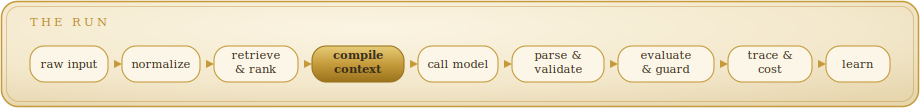
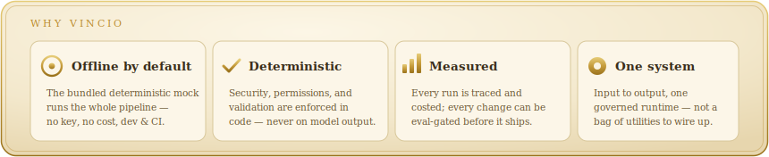
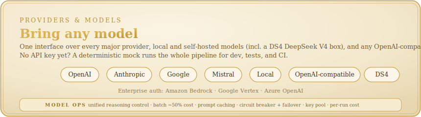
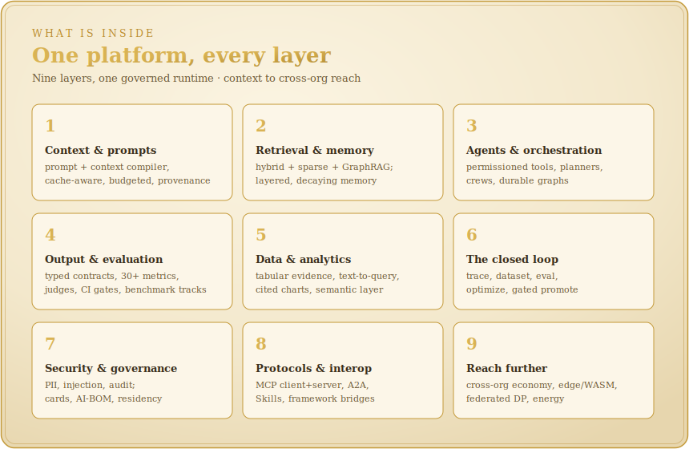
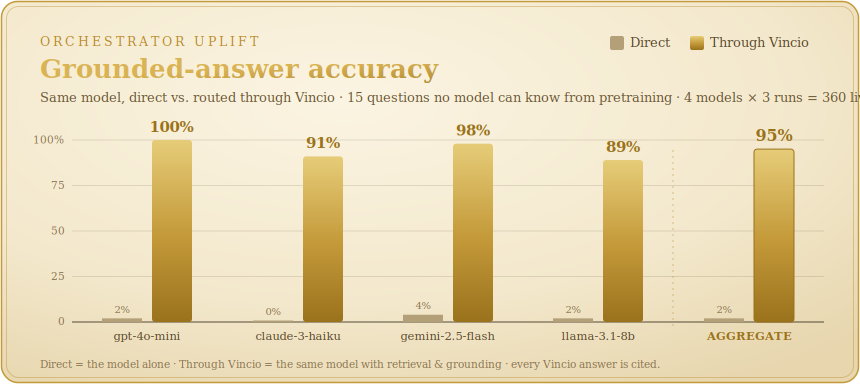
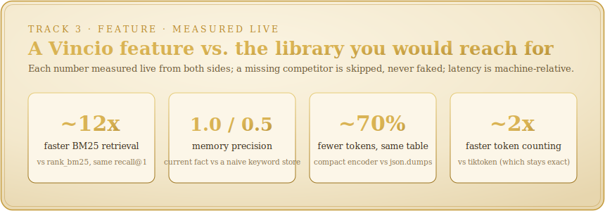
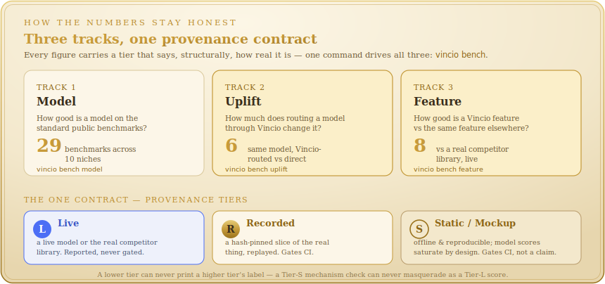
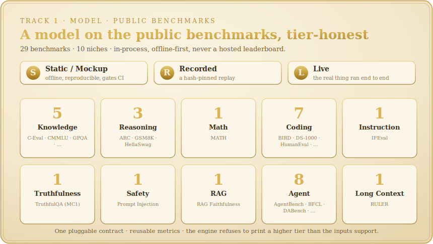
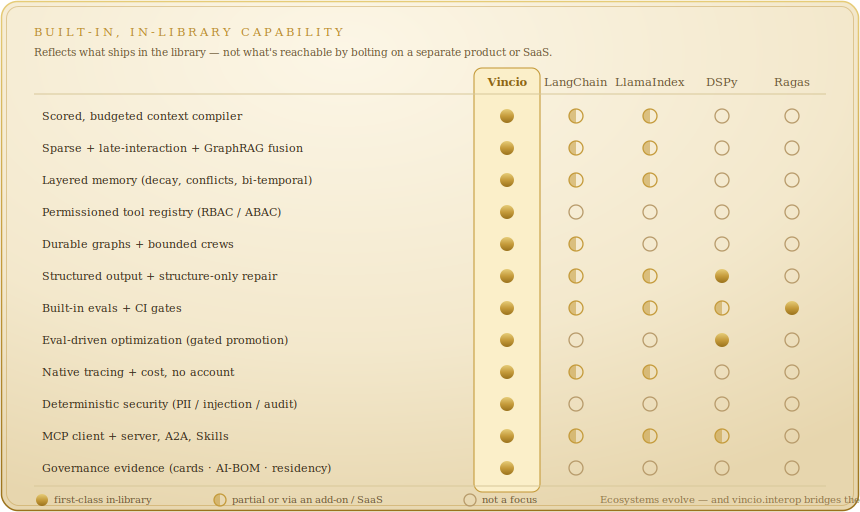
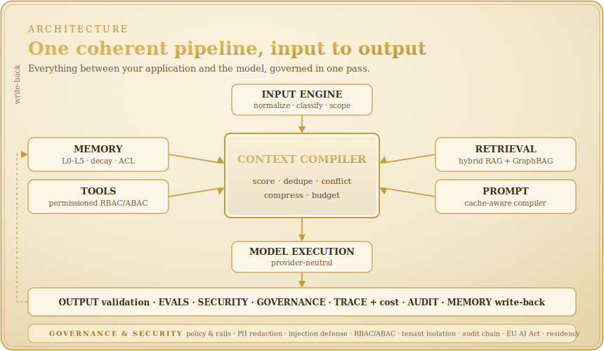

<p align="center">
  
</p>

<p align="center">
  <em>The scarce resource is not the model. It is the context you feed it.</em>
</p>

<p align="center">
  <a href="https://pypi.org/project/vincio/"></a>
  <a href="https://github.com/Ohswedd/vincio/actions/workflows/ci.yml"></a>
  
  
  
</p>

---

**Vincio is a Python platform for building AI applications that you can trust in production.**
It takes everything that goes *into* a model (prompts, memory, retrieved evidence, tools, schemas,
and policies) and compiles it into an optimized, validated, observable **context packet**; then it
checks, measures, and traces everything that comes *out*. Named for **Leonardo da Vinci**,
it pairs engineering and craft in equal measure.

<p align="center">
  
</p>

Most libraries help you *call* a model. Vincio governs the **boundary** between your application and
the model: what evidence is selected, how it is scored and budgeted, how the result is validated,
and what it cost. It runs on your model of choice across every major provider, with batching,
caching, failover, and cost tracking built in.

> **Try it in 30 seconds, no install:** open the
> [**quickstart notebook in Google Colab**](https://colab.research.google.com/github/Ohswedd/vincio/blob/main/examples/notebooks/01_quickstart.ipynb)
> — one `pip install`, runs offline on the bundled mock provider, no API key required.

<p align="center">
  
</p>

<details>
<summary><b>Why you'd reach for it, in one line each</b></summary>

- **Runs on any model.** Call OpenAI, Anthropic, Google, Mistral, a local model, or any OpenAI-compatible gateway through one interface, with batching, caching, failover, and cost tracking built in.
- **Develops and tests offline.** Pass the bundled deterministic `MockProvider` (it emits schema-valid output) and the whole pipeline — retrieval, validation, evals, traces, cost — runs in dev and CI with no network and no key. Flip one env var to point at a real model.
- **Deterministic where it counts.** Security, permissions, and validation are enforced in code, never gated on model output. The same input compiles to the same packet.
- **Measured, not asserted.** Every run is traced and costed; every change can be gated by an eval suite before it ships.
- **One coherent system** from input to output, not a bag of utilities you wire together yourself.

</details>

## Contents

[Install](#install) · [Quickstart](#quickstart) · [The one-line front door](#the-one-line-front-door) ·
[What you can build](#what-you-can-build) · [Providers](#providers--models) · [Features](#features) ·
[Features, head to head](#features-head-to-head) · [How the numbers stay honest](#how-the-numbers-stay-honest) ·
[How Vincio compares](#how-vincio-compares) · [Examples](#examples) ·
[CLI](#command-line) · [Architecture](#architecture) · [Docs](#documentation)

## Install

```bash
pip install vincio                  # core (dependency-light: pydantic, httpx, pyyaml, typing-extensions)
pip install "vincio[openai]"        # + a provider (also: anthropic, google, mistral)
pip install "vincio[chroma]"        # + a vector store (also: pinecone, lancedb, postgres, …)
pip install "vincio[server]"        # + the FastAPI server (vincio serve)
pip install "vincio[all]"           # every optional integration
```

Python 3.11+. Every heavy integration (vector stores, OCR, server, OpenTelemetry, charts, …) is an
opt-in extra; the core stays small and runs offline.

## Quickstart

```python
from vincio import ContextApp

# Configure a provider (the default is OpenAI — set a provider + key, or pass one explicitly).
app = ContextApp(name="docs_qa", provider="openai", model="gpt-4o-mini")
app.add_source("docs", path="./docs", retrieval="hybrid")
app.set_policy("answer_only_from_sources", True)

result = app.run("How do I configure SSO?")
print(result.output)      # the grounded answer
print(result.citations)   # the evidence it actually cited
print(result.trace_id)    # every run produces a full trace
print(result.cost_usd)    # …and a cost
```

**Run it offline — no key, no network.** Pass the bundled deterministic mock; it auto-generates
schema-valid output, so the whole pipeline runs in dev and CI for real:

```python
from vincio.providers import MockProvider
app = ContextApp(name="docs_qa", provider=MockProvider(), model="mock-1")
```

Set `VINCIO_PROVIDER` + the matching key in the environment (or pass `provider=`/`model=`) to point
the same code at OpenAI, Anthropic, Google, Mistral, a local model, or any OpenAI-compatible gateway.

## The one-line front door

For the five jobs you reach for most, the `vincio.tasks` namespace is one expression each — a
task-shaped constructor with sane governed defaults that **lowers to the exact same governed run** as
the verbose builder path (retrieval, grounding, validation, rails, budgets, tracing, and the audit
chain all apply unchanged). `.app` is the escape hatch to every deep method.

```python
from vincio import rag, extractor, tool_agent, evaluation, chat, Flow

rag("./docs").ask("How do I configure SSO?")          # grounded RAG Q&A, cited and eval-scored
extractor(Ticket).extract("I was charged twice")      # typed structured extraction
tool_agent(writes=[create_ticket]).run(task)          # an approval-gated tool agent
evaluation(dataset, gates={"groundedness": ">= 0.8"}).run()   # an offline eval
chat().send("What's my refund window?")               # a multi-turn assistant

# …or thread the whole pipeline fluently — the Vincio answer to LCEL:
Flow(provider=p, model=m).retrieve("./docs").ground().evaluate("groundedness").run(question)
```

These are `@experimental` while their shape settles. See
[`examples/00_one_liners.py`](examples/00_one_liners.py) and the
[ergonomic-surface concept](docs/concepts/ergonomic-surface.md) for how each one-liner maps to the
deep methods it composes.

## What you can build

**Typed output you can rely on**: declare a Pydantic schema, get a validated instance back:

```python
from pydantic import BaseModel
from vincio import ContextApp
from vincio.providers import MockProvider

class Triage(BaseModel):
    label: str
    confidence: float

# (provider=MockProvider() runs this offline; use a real provider in production)
app = ContextApp(name="triage", provider=MockProvider(), model="mock-1", output_schema=Triage)
app.run("The dashboard crashes after login").output.label   # → a validated Triage
```

**Agents with tools, memory, and hard budgets**: permissioned tools, approval-gated writes, and a
loop that cannot run away:

```python
app = ContextApp(name="support", output_schema=RefundDecision)
app.add_memory(scope="user", strategy="semantic")
app.add_tool(lookup_order, permissions=["orders:read"])
app.add_tool(issue_refund, permissions=["refunds:write"], approval_required=True)
app.run("Refund my duplicate charge")
```

**A real backend service** you can copy: `examples/applications/` ships a FastAPI grounded-RAG
service, a ticket-triage API, a structured-extraction service, and a CLI research agent — each
runnable fully offline. See **[Examples](#examples)**.

## Providers & models

Vincio calls real models in production. One interface routes to every major provider, with the
model-operations layer (reasoning control, half-cost batch, caching, failover, cost tracking) built
in. The deterministic mock is a development convenience, not the product: pass it to build and test
the whole pipeline with no key and no cost before you point it at a real model.

<p align="center">
  
</p>

<details>
<summary><b>Providers, model operations, and the mock</b></summary>

- **Providers**: OpenAI, Anthropic, Google (Gemini), Mistral, local models, and any OpenAI-compatible gateway (Groq, Together, Fireworks, OpenRouter, and the like) through one `ModelProvider` interface.
- **Self-hosted DeepSeek V4**: point at your own [DS4](https://github.com/antirez/ds4) box (antirez's `ds4-server`) as a first-class provider (`provider="ds4"`) — thinking modes on the reasoning controller, disk-KV cache accounting, fail-closed on-prem residency, and an honest self-hosted `$0` in the cost table.
- **Enterprise auth**: Amazon Bedrock, Google Vertex, and Azure OpenAI via pluggable auth strategies (SigV4, service-account, Azure AD / key).
- **Model operations**: unified reasoning/thinking control across providers, batch backends (~50% cost), prompt-cache strategy, a circuit breaker with health-aware failover, a key pool, and a data-driven `ModelRegistry` (capabilities, pricing, lifecycle) that drives capability guards and shadow / canary dispatch. Its shipped catalog prices the current lineup of every provider and is held by a coverage gate, so no current model silently bills $0.
- **The mock**: `MockProvider` is deterministic and emits schema-valid output, so the full pipeline (retrieval, validation, evals, traces, cost) runs offline in CI with no key and no cost. Pass it explicitly for development and tests; use a real provider in production.

```python
# point an app at a real model (or set VINCIO_PROVIDER / the API key in the environment)
app = ContextApp(name="docs_qa", provider="openai", model="gpt-4o-mini")
```

</details>

## Features

Everything below is implemented, tested offline, and demonstrated by a runnable example. Use the
high-level `ContextApp`, or reach for any engine directly. The section that follows —
**[Features, head to head](#features-head-to-head)** — then benchmarks each headline capability against
the raw model *and* the competitor library, with the mechanism that produces the difference.

<p align="center">
  
</p>

<details>
<summary><b>Every engine, in detail</b></summary>

**Context & prompts**
- Prompt compiler: typed prompt ASTs with `${variables}`, lint rules, cache-aware stable-prefix layout, versioning, hashing, and diffing.
- Context compiler: scores every candidate (relevance, novelty, authority, freshness, provenance, token cost, leakage risk), deduplicates, resolves conflicts, compresses, and packs to a token budget, with an *excluded-context report* explaining every omission.
- Tabular evidence: a typed, columnar `Dataset` and a deterministic `DataEncoder` that renders it header-once — lossless, columnar-accurate in token cost, far cheaper than `json.dumps` or a Markdown table; `TableEvidence` scores and cites it like any other evidence.
- Governed text-to-query, a multi-step data-analysis agent, content- & data-bound charts, a streaming out-of-core path, a governed semantic layer, **windowed real-time analytics** over an unbounded event stream (`StreamWindow` — tumbling / sliding / session), and **cross-org federated analytics** (`app.federated_data_engagement`) — one governed metric run across organizations with only aggregated, cited results crossing the trust boundary, never the raw rows — the whole data & analytics plane, every answer citing the exact source cells or events and `verify()`-ing offline. Explore it **interactively** with `notebook_session(app, ...)`: cited inline reprs and a register → query → analyze → chart → cite session that seals into the same signed `DataNarrative` a script does. See the [data analysis guide](docs/guides/analyze-data.md).

**Retrieval & memory**
- Hybrid RAG: BM25 + dense + learned-sparse + late-interaction fused in one weighted RRF; query understanding (HyDE, multi-query, decomposition); sentence-window / auto-merging chunking; GraphRAG; structured metadata filters with tenant scope; text + image + table + video evidence as first-class scored candidates. `embedder="auto"` (semantic when a local ONNX model is installed, deterministic hash otherwise) and grow-only adaptive `top_k` are opt-in, byte-identical defaults.
- Context anchors: mark a source `anchor=True` to keep a PRD / spec / brand frame **always-present across a whole multi-call task** — it's distilled once into a compact, constraint-first, content-hash-cached brief injected as **pinned** evidence into every call at a flat few-hundred-token cost (~28× smaller than the corpus), guaranteed into the packet at every drop point without ever exceeding the budget, while on-demand detail still flows through normal retrieval. Beats "paste every MD file every call" (token-hungry) and "pure per-query RAG" (drops the constraint on a lexical miss). Inspect it with `app.task_brief()`.
- LAGER (reasoning-driven retrieval): `app.use_lager()` replaces "retrieve top-k chunks then generate" with a **lazy evidence loop** — the corpus becomes atomic, byte-exact, offline-verifiable **Evidence Objects** in a typed knowledge graph (supports / contradicts / depends-on / follows, with a precision-gated contradiction detector), and retrieval acquires only what the query's information needs require, expanding the graph until marginal gain is insignificant. Finds multi-hop bridges that share zero words with the query where same-budget top-k structurally cannot (offline-gated vs the real in-repo baseline); sends the model ~23× fewer evidence tokens at the classic default configuration; abstains honestly with uncovered needs named; every retrieval decision explainable via the per-round gain trace. When an embedder is configured, a dense signal further tightens coverage — recalling a topic paraphrase of the cause and, opt-in, rejecting an off-topic same-document decoy — while the pure-stdlib default stays byte-identical. Live: **100% vs classic RAG's 75% at ~8× fewer input tokens/call**.
- Layered memory: session → episodic → semantic → tenant → graph, with a guarded write pipeline, confidence decay, contradiction resolution, bi-temporal recall, per-memory ACLs, and audited GDPR-style edit/forget/export.

**Agents & orchestration**
- Tools: permissioned registry (RBAC + ABAC), schema-from-typehints, a resource-limited sandbox, idempotent write guardrails with approval callbacks, and a grounded computer-use action plane.
- Universal web browsing & search: `app.use_web_search()` gives **any** model — hosted, gateway, or a local GGUF with no function calling — the same governed `web_search` / `web_read` tools over DuckDuckGo (or any pluggable engine). Reading is adaptive (query excerpts / a whole section / the full article / auto), preserves code blocks, and flags cookie walls, paywalls, and JS-shells so the model routes around dead pages; a pasted link or "summarize …" is auto-fetched as untrusted, screened evidence with no tool round; and `app.web_crawl(seeds)` walks a site into a verifiable `WebCollection` that becomes retrieval documents or a `Dataset`. Fetches are SSRF-hardened (per-redirect-hop re-checks, obfuscated-IP-literal normalization, streamed gzip-bomb caps), when-to-search judgement ships as a date-stamped progressively-disclosed skill, and every read is a content-hashed `WebEvidence` the session `verify()`s offline. Models without native tool calling run the identical loop through the `ToolProtocolProvider` text protocol.
- Agents: bounded DAG execution with planners (ReAct / plan-and-execute / hierarchical HTN), in-place plan repair, cost-aware action selection, and a budgeted deep-research agent — web-backed in one line via the `websearch` connector.
- Orchestration: multi-agent crews with a shared blackboard, durable stateful graphs (checkpoint / resume / time-travel / human-in-the-loop), deterministic workflows, and a distributed durable-execution backend.

**Output, evaluation & observability**
- Structured output: Pydantic contracts, constrained decoding, streaming validation with early abort, bounded self-correction that repairs structure only (never invents facts), and DSPy-style typed signatures.
- Evaluation: golden datasets, 30+ metrics, deterministic / model / G-Eval judges, synthetic data, red-teaming, trajectory & tool-use scoring, drift detection, regression gates, and a `pytest` plugin.
- Benchmark platform: three tracks under one honesty contract — **model** (the standard public benchmarks: MMLU, GPQA, GSM8K, HumanEval, IFEval, TruthfulQA, RULER, … by niche), **uplift** (the same model routed through Vincio vs called directly, per-benchmark delta), and **feature** (a Vincio feature — memory, RAG, output repair, … — vs the same feature in a competitor library, measured live). An enforced **provenance tier** (Live / Recorded / Static-mockup) on every number; reports, a ranked leaderboard, and a run store. Driven by `vincio bench`; in-process, never a hosted leaderboard.
- Observability: full trace span trees, OpenTelemetry export, a local trace viewer, a versioned prompt registry, and per-run cost tracking — no account or hosted backend required.

**The closed loop**
- Optimization: one reproducible cycle (trace → dataset → eval → optimize → promote): a reflective GEPA/MIPRO optimizer, a distillation flywheel, on-policy reinforcement from verifiable rewards, and gated deploy with canary + rollback. No promotion ships without clearing the gates.

**Security & governance**
- Security: deterministic PII / secret redaction (multilingual), prompt-injection defense and provable containment (taint tracking + capability tokens), RBAC / ABAC, tenant isolation, and a hash-chained, signed audit log with offline tamper verification.
- Governance: model / system cards, an OWASP / NIST / MITRE / ISO compliance matrix, an AI-BOM, provable erasure, a consent ledger, data-residency enforcement, formal invariant verification, agent identity & delegation, verified-reasoning certificates — including statistical trend / correlation / interval / forecast kernels that certify an analytical claim from its cited cells and refute correlation stated as causation — and continuous assurance cases.

**Interop**
- Protocols: MCP (client *and* server), A2A agent-to-agent, and Agent Skills, all in-process.
- Ecosystem: import/export LangChain, LlamaIndex, Haystack, and DSPy assets; first-party data connectors; and any OpenAI-compatible model or vector store you already run.

**Reach further:** a cross-organization agent economy (negotiation, contracts, durable sagas, metering, settlement, arbitration, reputation, collateral & solvency proofs), an edge / WASM in-process runtime, on-device LoRA adaptation, federated learning with a differential-privacy accountant, and per-run energy / carbon accounting. See [`ROADMAP.md`](ROADMAP.md).

</details>

## Features, head to head

Vincio's claims are **measured, not asserted**. For every headline capability below we show the same
job through **three lenses** — the **raw model** alone, the **competitor** a team would otherwise
reach for, and **Vincio** — and then the *mechanism* that produces the difference. Every cell carries
a **provenance tier**: <kbd>L</kbd> live (a real model or the real competitor library ran end to end,
dated, reported) or <kbd>S</kbd> static-deterministic (offline, reproducible, **gates CI**). Honest
losses are in the table too — where a specialist wins, we say so.

> Not every feature has all three lenses: a pure-efficiency primitive (tabular encoding, chunking) has
> no "raw model" axis, and a governance guarantee (injection containment) has no competitor that offers
> the same *provable* property. A blank cell (—) means "not applicable / not measured," never a hidden
> number. The three columns come from three separate harnesses (`vincio bench uplift` for raw→Vincio,
> `vincio bench feature` for competitor→Vincio) — labeled, never one fabricated run.

### The scorecard

| Capability | Raw model | Competitor library | **Vincio** | Why Vincio wins (the mechanism) | Tier |
|---|---|---|---|---|:--:|
| **Grounded RAG** — private-knowledge Q&A | **13%** correct (hallucinates or abstains) | paste-everything (`stuff`): answers, **~1,253 tok**, uncited | **95% correct · every answer cited · 137 tok** | context compiler scores + budgets the evidence; *answer-only-from-sources* + citation extraction turn a guesser into a grounded, cited answerer | L·S |
| **Reasoning retrieval** — multi-hop, zero lexical overlap | **25%** (no retrieval) | classic top-k RAG **75% @ ~1,078 tok** (misses the bridge) | **100% @ ~123 tok** (~8× fewer) | Evidence Objects in a typed graph + a lazy needs-driven loop reach a bridge sharing **zero words** with the query that top-k structurally can't | L·S |
| **Task-frame retention** — a rule that binds every step | — | pure per-query RAG **50% @ ~3.2k tok** (drops the rule) | **100% @ ~3.4k tok** (matches "paste everything" at ~3× fewer tok) | the frame is distilled **once** into a cached constraint-first brief, **pinned** into every call — never dropped on a lexical miss, never re-paid per call | L |
| **Layered memory** — the *current* fact after an update | raw buffer **loses the fact** (1,267 tok @160 turns) | naive keyword store **precision 0.50** (returns the stale fact too) | **precision 1.00 · 33 tok** | guarded writes + confidence decay + contradiction resolution + bi-temporal recall return only the current fact, at a flat cost | S |
| **Structured output** — schema-valid rate | **1/6** valid | `json_repair`: recovers more — *by guessing field values* (head-to-head below) | **5/6** valid — **structure-only** (never invents a value) | constrained decoding + streaming validation + bounded structure-only repair: safe for typed extraction, where guessing is not | S |
| **Prompt-injection containment** | **compromised** (exfil call runs) | detection-based: **would miss** this injection | **contained** (tainted call denied, authorized call ok) | deterministic taint tracking + capability tokens — a *provable* property, not a classifier that can be fooled | S |
| **Long-context recall** — a needle at depth | **0.0** (lost) | — | **1.0** | the long-context governor keeps the needle in budget instead of trusting attention over a full window | S |
| **Web freshness** — facts after the training cutoff | **0/3** fresh | — | **2/3** fresh (current Python 3.14, Node 26) | governed `web_search` / `web_read` for **any** model (even one with no tool calling) returns content-hashed, verifiable evidence | L |
| **Context assembly** — tokens for the same evidence | — | `stuff` everything: **1,253 tok** | **137 tok** (~89% fewer) | score → dedup → resolve conflicts → compress → budget, with an excluded-context report | S |
| **Tabular evidence** — tokens for a 50×5 table | — | `json.dumps`: **1,901 tok** | **574 tok** (~70% fewer), lossless + typed | a header-once columnar `DataEncoder`, costed on the tokens the model actually receives | S |
| **BM25 retrieval** — recall & speed | — | `rank_bm25`: recall 1.0 @ **2.0 ms** | recall **1.0 @ 0.19 ms** (~10×; ~30–40× @ 20k docs) | an inverted index scans only documents containing a query term, so the lead **grows with corpus size** | S·L |
| **Chunking** — traceable chunks | — | naive char-split: **0** provenance | **1.0** provenance (every chunk citable) | chunks carry their source id and respect structure, so a retrieved chunk is traceable | S |
| **Tokenization** *(honest loss)* | — | `tiktoken`: **exact** @ 1.6 ms | **0.73** accuracy @ **0.85 ms** (~1.9× faster) | a conservative zero-dependency heuristic — faster and dependency-free, but `tiktoken` is exact; use it when you need the exact count | S·L |

<sub><kbd>L</kbd> numbers are dated live runs (OpenRouter, July 2026) reported below; <kbd>S</kbd>
numbers are deterministic and gate CI; <kbd>S·L</kbd> pairs a deterministic metric (recall/accuracy,
CI-gated) with a wall-clock speed ratio (machine-specific, reported — ratios are the portable signal).
The "raw model" figures for Grounded RAG (13%) and Web freshness are live-model means; the deterministic
mockup (`rag.grounded` 0.5→1.0) gates the same mechanism in CI.</sub>

<details>
<summary><b>The live evidence, in full — the four <kbd>L</kbd>-tier runs behind the scorecard</b></summary>

<p align="center">
  
</p>

**1 · Grounded RAG on current SOTA models** — 15 company-specific questions a model cannot know from
pretraining; the same model direct vs. through Vincio (mean over 2 runs, every routed answer cited;
`benchmarks/quality_uplift.py`, OpenRouter, July 2026):

| Model: direct vs. through Vincio | Direct correct | **Via Vincio** | Direct failure mode | Cost per *correct* answer |
|---|--:|--:|:--|:--|
| `anthropic/claude-opus-4.8` | 13% | **97%** | abstains 100%¹ (never hallucinates) | **~30× cheaper** via Vincio |
| `openai/gpt-5.4-mini` | 10% | **93%** | hallucinates 83% | **~16× cheaper** via Vincio |
| `google/gemini-3.5-flash` | 27% | **97%** | hallucinates 63% | **~14× cheaper** via Vincio |
| `meta-llama/llama-3.1-8b-instruct` | 3% | **93%** | hallucinates 50% | **~28× cheaper** via Vincio |
| **Aggregate** | **13%** | **95%** | — | n/a |

<sub>¹ Even the strongest current model answers only ~13% of company-specific questions directly — the
best ones *abstain* the rest of the time (0% hallucination), the weaker ones fabricate. Either way the
model alone is near-useless on private knowledge; the same model through Vincio's retrieval + grounding
answers 93–97%, cited. A direct call is cheaper *per call* but answers almost nothing, so its cost **per
correct answer** is 14–30× higher. Small sample (n=15); rerun with `VINCIO_PROVIDER=openrouter
VINCIO_UPLIFT_MODELS=… python benchmarks/quality_uplift.py`.</sub>

**2 · Multi-hop retrieval via LAGER** — four questions over an incident corpus whose causal bridge
shares **zero words** with the questions, plus 40 distractors saturated with them. Three arms, the same
model (`benchmarks/lager_uplift_live.py`, OpenRouter, 2026-07-04):

| Model · arm | Accuracy | Input tokens/call |
|---|--:|--:|
| `gpt-4o-mini` — floor / classic / **LAGER** | 25% / 75% / **100%** | 30 / 1,078 / **123** |
| `llama-3.3-70b` — floor / classic / **LAGER** | 25% / 75% / **100%** | 41 / 1,080 / **138** |

<sub>LAGER answers every multi-hop question at **~8× fewer input tokens/call** than the classic pipeline,
which misses the zero-overlap bridge. The offline `lager` family gates the mechanism against the real
in-repo baseline (bridge found where top-k misses it, ~23× evidence-token reduction at equal
correctness, one-round easy queries, cross-process determinism, honest abstention).</sub>

**3 · Task-frame retention via context anchors** — a coding agent is bound by a bulk of standards, then
asked tasks that never restate the rule. `stuff` (paste every file) / `pure_rag` (retrieve per query) /
`anchors` (`benchmarks/rag_anchor_uplift_live.py`, OpenRouter, 2026-07-03):

| Model · arm | Rule respected | Input tokens/call |
|---|--:|--:|
| `gpt-4o-mini` — stuff / pure-RAG / **anchors** | 100% / 50% / **100%** | 10,166 / 3,202 / **3,372** |
| `llama-3.3-70b` — stuff / pure-RAG / **anchors** | 100% / 50% / **100%** | 10,175 / 3,212 / **3,381** |

<sub>Anchors match stuffing on adherence at **~3× fewer input tokens/call**, while pure per-query RAG
drops the globally-binding rule to 50% on tasks that don't lexically match it. On a larger corpus the
gap widens; the offline `rag_anchors` family gates the mechanism (~28× brief reduction, frame guaranteed
at every drop point, never over budget).</sub>

**4 · Post-cutoff freshness via the web plane** — facts that changed *after* the model's training cutoff
(latest Python line, current & LTS Node.js majors); the same model with `app.use_web_search()`
(`benchmarks/web_uplift_live.py`, OpenRouter, 2026-07-03):

| Model: direct vs. + Vincio web search | Direct fresh | **+ web search** |
|---|--:|--:|
| `openai/gpt-4o-mini` | 0/3 | **2/3** |
| `meta-llama/llama-3.3-70b-instruct` | 0/3 | **2/3** |

<sub>Direct answers were stale on every question (e.g. "Python 3.11", "Node 18/19"); with web search the
same models answered the current Python 3.14 line and Node.js 26. The one miss on both is a genuinely
hard distinction (Active-LTS vs Current) — the benchmark is not rigged.</sub>

</details>

<details>
<summary><b>The deterministic mechanism metrics — <kbd>S</kbd> tier, hold for <i>any</i> model, gate CI</b></summary>

These are mechanical (no model judgement), so they run offline and hold for every model. The `vincio
bench uplift` and `vincio bench feature` mockups gate them in CI.

<p align="center">
  
</p>

**Same model, direct vs. via Vincio** (`vincio bench uplift`):

| Benchmark | Direct | Via Vincio |
|---|--:|--:|
| Grounded answering (RAG faithfulness) | 0.5 | **1.0** |
| Structured-output validity | 1/6 | **5/6** |
| Long-context needle recall | 0.0 | **1.0** |
| Prompt-injection containment | compromised | **contained** |
| Web-search freshness | 0.0 | **1.0** |
| Context tokens to keep an early fact @160 turns | 1,267 (lost) | **33 (retained)** |

**Vincio vs. the competitor library** (`vincio bench feature`, competitor installed; Apple Silicon,
Python 3.13 — ratios are the portable signal):

| Contest | Vincio | Competitor | Result |
|---|---|---|---|
| BM25 recall@1 & latency | recall 1.0 @ 0.19 ms | `rank_bm25` recall 1.0 @ 2.0 ms | **~10× faster, identical recall** (grows with corpus) |
| Context assembly (tokens) | 137 | `stuff` 1,253 | **~89% fewer**, answer retained |
| Tabular encoding (tokens, 50×5) | 574 | `json.dumps` 1,901 | **~70% fewer**, lossless typed |
| Current-fact precision after an update | 1.0 | naive keyword store 0.5 | **exact recall of the current fact** |
| Malformed-JSON recovery | 0.50 | `stdlib json` 0.125 · `json_repair` **1.0** | Vincio beats stdlib; `json_repair` recovers more — *by guessing*, unsafe for typed extraction |
| Missing-variable render | caught (typed error) | `jinja2` silently empty | **fails loud**, never a silent blank |
| Token counting | 0.73 acc @ 0.85 ms | `tiktoken` **1.0** @ 1.6 ms | **~1.9× faster, zero-dep** — `tiktoken` is exact |
| Chunk provenance | 1.0 | naive char-split 0.0 | every chunk **traceable & citable** |

The point isn't that every component beats every specialist — a dedicated JSON-repair library recovers
more than Vincio (by guessing, which is unsafe for typed extraction), and `tiktoken` is exact. Vincio's
edge is an **integrated, correct, governed** pipeline, not a pile of single-purpose libraries.

</details>

## How the numbers stay honest

The three columns above come from Vincio's own **benchmark platform**: three tracks under one honesty
contract, where every number carries a **provenance tier** that says, structurally, how real it is — so
you never have to guess whether a figure is `LIVE`, `STATIC/FABRICATED`, or a self-measurement. One
command drives all three: `vincio bench model | uplift | feature`. The map is
[`benchmarks/PROVENANCE.md`](benchmarks/PROVENANCE.md); the machine-readable source of truth is
[`benchmarks/manifest.json`](benchmarks/manifest.json).

<p align="center">
  
</p>

| Track | Question it answers | Compares | Column above | Command |
|---|---|---|---|---|
| **1 · Model** | how good is a *model* on the public benchmarks? | a model vs the benchmark's verifiable gold | (context) | `vincio bench model` |
| **2 · Uplift** | how much does routing a model *through Vincio* change it? | the same model, Vincio-routed vs direct | **Raw model → Vincio** | `vincio bench uplift` |
| **3 · Feature** | how good is a Vincio *feature* vs the same feature elsewhere? | a Vincio feature vs a real competitor library | **Competitor → Vincio** | `vincio bench feature` |

**Provenance tiers.** <kbd>L</kbd> Live — a live model, or the real competitor library on this machine
(reported, never gated). <kbd>R</kbd> Recorded — a hash-pinned replay (gates CI). <kbd>S</kbd>
Static/Mockup — offline, reproducible, gates CI (model scores *saturate by design*). **A lower tier can
never print a higher tier's label** — a Tier-S mechanism check can never masquerade as a Tier-L score.

**Track 1 — Model** scores a model (or a model *version*) on the standard public benchmarks: one
pluggable contract, **29 benchmarks across 10 niches**, an enforced tier on every number, in-process and
**never a hosted leaderboard**. Live over official dataset slices (OpenRouter, small `n` — a reported
capability demo): `gpt-5.4-mini` scored **0.90** on a 20-item GSM8K slice; `gemini-3.5-flash`
**0.70 / 0.93** (MMLU / GSM8K).

<details>
<summary><b>The 29 public benchmarks, by niche</b></summary>

<p align="center">
  
</p>

Run live over real official dataset slices:

```bash
python benchmarks/eval_live.py --provider anthropic --model claude-opus-4-8 \
    --benchmarks knowledge.mmlu reasoning.gsm8k --tier live --dataset-dir ./datasets
```

The engine **refuses** to let a fabricated fixture print a Recorded or Live label — a Tier-S mechanism
check can never masquerade as a Tier-L score.

</details>

```bash
vincio bench list                                   # the whole platform at a glance
vincio bench model all --tier static                # every benchmark, offline (Tier-S), gates CI
vincio bench uplift                                 # raw model → Vincio, per benchmark
vincio bench feature                                # a Vincio feature vs a competitor library (LIVE)
```

**VincioBench, the internal gate** ([`vinciobench.py`](benchmarks/vinciobench.py)) is *not* a
competitive claim: it is the deterministic mechanism/regression gate (**62 families**) that asserts each
engine still works on a bundled synthetic corpus, so a regression fails the build. Its scores saturate
by design; the credible performance evidence is the three tracks above at their Live tier. Concept:
[open-evaluation-plane](docs/concepts/open-evaluation-plane.md); guide:
[run-benchmark-suite](docs/guides/run-benchmark-suite.md).

## How Vincio compares

Each ecosystem below is strong in its focus area. This reflects **built-in, in-library** capability,
not what's reachable by adding a separate product or SaaS.

<p align="center">
  
</p>

<details>
<summary><b>Show the full matrix</b></summary>

| Capability | **Vincio** | LangChain | LlamaIndex | DSPy | Ragas |
|---|:--:|:--:|:--:|:--:|:--:|
| Scored, budgeted **context compiler** | ✅ | ➖ | ➖ | ❌ | ❌ |
| **Sparse + late-interaction + GraphRAG** in one fusion | ✅ | ➖ | ➖ | ❌ | ❌ |
| Layered **memory** (decay, conflicts, bi-temporal) | ✅ | ➖ | ➖ | ❌ | ❌ |
| **Permissioned** tool registry (RBAC/ABAC) | ✅ | ❌ | ❌ | ❌ | ❌ |
| **Durable graphs** + bounded crews | ✅ | ➖ | ❌ | ❌ | ❌ |
| Structured output + **structure-only repair** | ✅ | ➖ | ➖ | ✅ | ❌ |
| Built-in **evals + CI gates** | ✅ | ➖ | ➖ | ➖ | ✅ |
| Eval-driven **optimization** (gated promotion) | ✅ | ❌ | ❌ | ✅ | ❌ |
| Native **tracing + cost**, no account | ✅ | ➖ | ➖ | ❌ | ❌ |
| **Deterministic security** (PII / injection / audit) | ✅ | ❌ | ❌ | ❌ | ❌ |
| **MCP** client *and* server + **A2A** + **Skills** | ✅ | ➖ | ➖ | ➖ | ❌ |
| **Governance evidence** (cards · AI-BOM · erasure · residency) | ✅ | ❌ | ❌ | ❌ | ❌ |

✅ first-class in-library · ➖ partial or via an add-on/SaaS · ❌ not a focus. Ecosystems evolve, and
Vincio is built to *interoperate*: `vincio.interop` brings LangChain, LlamaIndex, Haystack, and DSPy
assets in (and hands Vincio's back). See the in-depth write-ups in
[`docs/comparisons/`](docs/comparisons).

</details>

## Examples

A three-tier on-ramp in [`examples/`](examples) — start in the browser, learn each subsystem, then
copy a real backend. Every tier runs **fully offline** on the bundled mock and points at a real model
with one env var; each is gated in CI so it can never drift.

### 1 · Notebooks — start in the browser

Six **Google Colab-ready** notebooks ([`examples/notebooks/`](examples/notebooks)), one `pip
install` and no setup:

| Notebook | Open in Colab |
|---|---|
| [Quickstart](examples/notebooks/01_quickstart.ipynb) | [](https://colab.research.google.com/github/Ohswedd/vincio/blob/main/examples/notebooks/01_quickstart.ipynb) |
| [RAG](examples/notebooks/02_rag.ipynb) | [](https://colab.research.google.com/github/Ohswedd/vincio/blob/main/examples/notebooks/02_rag.ipynb) |
| [Agents & tools](examples/notebooks/03_agents_and_tools.ipynb) | [](https://colab.research.google.com/github/Ohswedd/vincio/blob/main/examples/notebooks/03_agents_and_tools.ipynb) |
| [Evaluation](examples/notebooks/04_evaluation.ipynb) | [](https://colab.research.google.com/github/Ohswedd/vincio/blob/main/examples/notebooks/04_evaluation.ipynb) |
| [Data analysis](examples/notebooks/05_data_analysis.ipynb) | [](https://colab.research.google.com/github/Ohswedd/vincio/blob/main/examples/notebooks/05_data_analysis.ipynb) |
| [Notebook-native analysis](examples/notebooks/06_notebook_native_analysis.ipynb) | [](https://colab.research.google.com/github/Ohswedd/vincio/blob/main/examples/notebooks/06_notebook_native_analysis.ipynb) |

### 2 · Feature tours — one program per subsystem

Twenty-one complete, heavily-commented programs (`00`–`21`); each runs offline and teaches a whole theme
end to end — the entire data & analytics plane is one tour (`13`). Highlights (full index in
[`examples/README.md`](examples/README.md)):

| # | Example | What it covers |
|--|---|---|
| 00 | [`one_liners`](examples/00_one_liners.py) | the `vincio.tasks` front door — `rag` / `extractor` / `tool_agent` / `evaluation` / `chat` / `Flow`, each lowering to the same governed run |
| 01 | [`quickstart`](examples/01_quickstart.py) | typed output · grounded QA with citations · trace & cost · a short conversation |
| 02 | [`retrieval_rag`](examples/02_retrieval_rag.py) | hybrid + sparse + late-interaction fusion · query understanding · GraphRAG · multimodal evidence |
| 04 | [`agents_and_tools`](examples/04_agents_and_tools.py) | permissioned tools · sandbox · planners · plan repair · deep research · computer-use |
| 07 | [`evaluation_observability`](examples/07_evaluation_observability.py) | datasets · metrics · judges · red-team · drift · tracing · prompt registry |
| 09 | [`security_governance`](examples/09_security_governance.py) | PII/injection/containment · audit · governance evidence · identity · verified reasoning · assurance |
| 12 | [`cross_org_economy`](examples/12_cross_org_economy.py) | negotiation · contracts · durable sagas · settlement · arbitration · solvency proofs |
| 13 | [`data_and_analytics`](examples/13_data_and_analytics.py) | the whole data plane in one tour — tabular evidence · profiling · governed text-to-query · the analysis agent · cited charts · streaming · the semantic layer · the data engagement · real-time windowed analytics · federated analytics · statistical certificates |
| 14 | [`model_pricing_registry`](examples/14_model_pricing_registry.py) | the data-driven `ModelRegistry` — real per-provider pricing, freshness horizons, and the coverage drift gate |
| 15 | [`connected_docs`](examples/15_connected_docs.py) | the capability map · Related cross-links · the learning path · the docs-graph check |
| 16 | [`open_evaluation_plane`](examples/16_open_evaluation_plane.py) | the three-track benchmark platform · public benchmarks by niche · provenance tiers (Static / Recorded / Live) · leaderboard & run store |
| 17 | [`compile_receipt`](examples/17_compile_receipt.py) | the packet compile receipt — why a packet compiled the way it did · `receipt_hash` · offline `verify()` · `diverges_from()` between runs |
| 18 | [`ds4_local_inference`](examples/18_ds4_local_inference.py) | a self-hosted DS4 DeepSeek V4 box as a first-class provider — thinking modes · disk-KV cache accounting · on-prem residency · honest self-hosted $0 |
| 19 | [`web_browser_search`](examples/19_web_browser_search.py) | universal web browsing & search — governed `web_search` / `web_read` for every model · token-budgeted page reading · the text protocol for models without tool calling · pre-egress policy · offline-verifiable evidence |
| 20 | [`context_anchors`](examples/20_context_anchors.py) | context anchors — keep a PRD / spec / brand frame across a whole coding task · `anchor=True` distills it once into a compact cached brief · pinned into every call at a flat cost (~26× smaller) · present even on a query that never mentions it and under a tiny window · on-demand detail still retrieves |
| 21 | [`lager_reasoning_retrieval`](examples/21_lager_reasoning_retrieval.py) | LAGER, reasoning-driven retrieval — byte-exact Evidence Objects in a typed knowledge graph · a lazy needs-driven loop instead of fixed top-k · multi-hop bridges found across zero lexical overlap · honest abstention · `app.use_lager()` |

### 3 · Applications — real-world backends

Small, production-shaped apps to copy ([`examples/applications/`](examples/applications)): a FastAPI
**grounded-RAG service**, a **ticket-triage API** (typed output + scoped memory + an approval-gated
tool), a **structured-extraction service** (self-correcting), and a no-framework **CLI research
agent**. Each FastAPI app splits an offline-testable `core.py` from a thin FastAPI `main.py`.

```bash
cd examples && python 01_quickstart.py            # offline, no keys
export VINCIO_PROVIDER=openai OPENAI_API_KEY=sk-... && python 01_quickstart.py   # against a real model
pip install "vincio[server]" && cd examples/applications/rag_service && uvicorn main:app --reload
```

## Command line

```bash
vincio init my-project --template rag   # scaffold config + app + golden set
vincio run app.py --input "..."         # run an app
vincio eval run golden.jsonl            # run an eval suite with CI gates + baseline compare
vincio bench list                       # the benchmark platform: model / uplift / feature tracks
vincio bench feature                    # a Vincio feature vs a competitor library (LIVE)
vincio bench model knowledge.mmlu       # a model on a public benchmark, tier-honest, offline
vincio trace view trace_123             # TUI trace tree with scores + feedback
vincio loop run --app app.py --gate groundedness=">= 0.8"   # one closed-loop cycle
vincio docs check                       # gate the docs graph (links, coverage, llms.txt freshness)
vincio audit verify                     # verify the audit-log hash chain offline
vincio mcp serve app.py                 # expose an app as an MCP server
vincio serve --app app.py               # launch the HTTP API (health/readiness/metrics)
```

The full CLI is in the [CLI reference](docs/reference/cli.md). `vincio serve` launches a FastAPI
server (API-key + JWT auth, SSE streaming, Prometheus metrics); `from vincio.server import
create_app` embeds it.

## Architecture

One coherent pipeline from raw input to traced, validated result: the input engine normalizes and
scopes the request; memory, retrieval, tools, and the prompt compiler all feed the **context
compiler**, which scores, deduplicates, resolves conflicts, compresses, and budgets; the model runs
provider-neutral; and every output is validated, evaluated, secured, traced, costed, and written
back to memory.

<p align="center">
  
</p>

See [`AGENTS.md`](AGENTS.md) for the package layout and [`docs/concepts/`](docs/concepts) for a tour
of each engine.

## Status

Vincio is **feature-complete and in long-term support**. The public API is frozen
under [Semantic Versioning](https://semver.org/spec/v2.0.0.html) with a mechanical
[deprecation policy](docs/reference/stability.md); performance and quality targets are
[published as SLOs](docs/reference/slo.md) and gated by VincioBench; releases ship a CycloneDX SBOM
with SLSA provenance. New capabilities are added behind opt-in extras, never by breaking working
code. The [`ROADMAP.md`](ROADMAP.md) records what ships today, and upgrade notes are in
[`MIGRATION.md`](MIGRATION.md).

Vincio is, and stays, a **library**. The building blocks for production (audit chain, retention,
tenant isolation, RBAC/ABAC, a server) ship in the package for you to deploy on your own
infrastructure. There is no hosted service.

## Documentation

The [documentation index](docs/README.md) maps every guide, concept, and reference page in a
reading order; the [learning path](docs/learning-path.md) is a staged route from your first app to
the full platform. Highlights:

- **[Getting started](docs/getting-started.md)**: install, your first app, offline development
- **Concepts**: [context packets](docs/concepts/context-packets.md) ·
  [prompt compiler](docs/concepts/prompt-compiler.md) · [memory](docs/concepts/memory.md) ·
  [retrieval](docs/concepts/retrieval.md) · [context anchors](docs/concepts/context-anchors.md) ·
  [agents & workflows](docs/concepts/agents.md) ·
  [evaluation](docs/concepts/evals.md) · [observability](docs/concepts/observability.md)
- **Guides**: [build a RAG app](docs/guides/build-rag-app.md) ·
  [structured output](docs/guides/structured-output.md) ·
  [add tools](docs/guides/add-tools.md) · [analyze data](docs/guides/analyze-data.md) ·
  [orchestrate multi-agent systems](docs/guides/orchestrate-agents.md) ·
  [run evals](docs/guides/run-evals.md) · [close the loop](docs/guides/close-the-loop.md) ·
  [performance & streaming](docs/guides/performance.md) · [integrations](docs/guides/integrations.md)
- **Protocols**: [MCP client + server](docs/guides/mcp.md) · [A2A](docs/guides/a2a.md) ·
  [Agent Skills](docs/guides/agent-skills.md) · [reasoning control](docs/guides/reasoning.md)
- **Migrating**: from [LangChain](docs/guides/migrate-from-langchain.md) ·
  [LlamaIndex](docs/guides/migrate-from-llamaindex.md) · [Ragas](docs/guides/migrate-from-ragas.md)
- **Security & governance**: [threat model](docs/security/threat-model.md) ·
  [security policy](SECURITY.md) · [governance & compliance](docs/guides/governance.md)
- **Reference**: [API](docs/reference/api.md) · [capability map](docs/reference/capability-map.md) ·
  [CLI](docs/reference/cli.md) · [config](docs/reference/config.md) · [SLOs](docs/reference/slo.md) ·
  [stability & deprecation](docs/reference/stability.md)
- **Comparisons**: [LangChain](docs/comparisons/langchain.md) ·
  [LlamaIndex](docs/comparisons/llamaindex.md) · [DSPy](docs/comparisons/dspy.md) ·
  [CrewAI](docs/comparisons/crewai.md) · [Ragas](docs/comparisons/ragas.md) ·
  [and more](docs/comparisons)

## Contributing

Contributions are welcome. The test suite runs fully offline and must stay green:

```bash
pip install -e ".[dev]"
python -m pytest -q          # the full offline suite — no network or API keys required
ruff check vincio/ tests/
mypy vincio
```

See [`AGENTS.md`](AGENTS.md) for the codebase layout and engineering conventions.

## License

[Apache License 2.0](LICENSE) © Vincio Contributors.
